

# **ĐẠI HỌC QUỐC GIA THÀNH PHỐ HỒ CHÍ MINH**
## **TRƯỜNG ĐẠI HỌC KHOA HỌC TỰ NHIÊN**
### **KHOA CÔNG NGHỆ THÔNG TIN**

 

### **BÁO CÁO HW01**
**Môn học:** Kiểm thử phần mềm
**Lớp:** 23KTPM2  
**MSSV:** 23127540  
**Sinh viên thực hiện:** Phạm Đức Toàn  

 

TP. Hồ Chí Minh, 2026

# 1 Requirement 1 - Thị trường việc làm QA/QC 2026+

## 1.1 QC Mid-Senior

- **Đường dẫn:** [Job
  Posting](https://www.topcv.vn/viec-lam/qc-mid-senior/2161770.html?ta_source=JobSearchList_LinkDetail&u_sr_id=w45WaC0TZFZxne0FBqt6Aa9sHyhyB7wjJvT9rhVk_1779974704)

  <figure id="fig:job_01" data-latex-placement="htbp">
  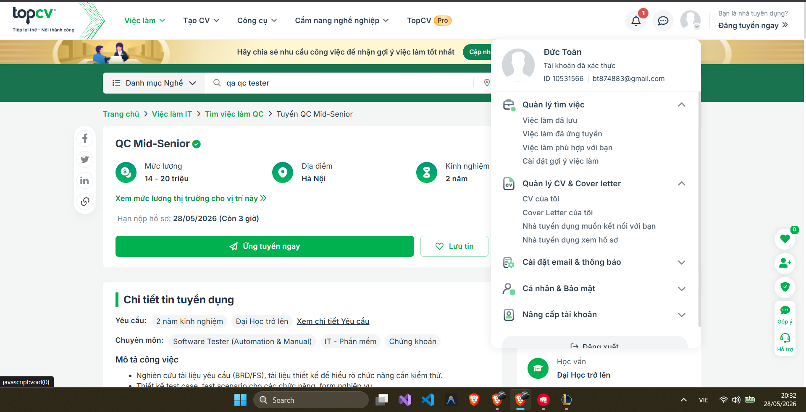
  <figcaption>Ảnh chụp màn hình tin tuyển dụng QC Mid-Senior</figcaption>
  </figure>

- **Lương:** 14 - 20 triệu/tháng

- **Mô tả công việc:**

  - Nghiên cứu tài liệu yêu cầu (BRD/FS), tài liệu thiết kế để hiểu rõ
    chức năng cần kiểm thử.

  - Thiết kế test case, test scenario cho các chức năng, form nghiệp vụ.

  - Thực hiện kiểm thử:

    - Functional Testing

    - Regression Testing

    - Re-test sau khi fix bug

  - Thực hiện log lỗi trên hệ thống quản lý bug (Redmine hoặc tương
    đương).

  - Theo dõi tiến độ xử lý lỗi và xác nhận kết quả fix.

  - Kiểm tra dữ liệu hệ thống bằng SQL để đảm bảo đúng theo thiết kế.

  - Test API bằng Postman.

  - Phối hợp với Dev, BA trong quá trình làm rõ lỗi và xác nhận yêu cầu.

- **Yêu cầu kỹ năng:**

  - Manual Testing

  - Viết Test Case / Test Scenario

  - Bug Tracking & Bug Lifecycle

  - SQL (SELECT, đối chiếu dữ liệu)

  - API Testing với Postman

  - Sử dụng công cụ quản lý lỗi như Redmine

  - Đọc hiểu tài liệu nghiệp vụ & tài liệu thiết kế

  - ISTQB

  - Kỹ năng làm việc nhóm với Dev/BA

  - Logical Thinking / Attention to Detail

- **Ảnh hưởng của AI đến công việc này:** AI có thể hỗ trợ tạo test
  case, phân tích bug và kiểm tra dữ liệu nhanh hơn (bằng ChatGPT hoặc
  Copilot). Tuy nhiên công việc vẫn cần tư duy logic và phối hợp với
  Dev/BA nên QA thủ công chưa bị thay thế hoàn toàn.

## 1.2 Chuyên Viên Kiểm Thử Phần Mềm / Tester

- **Đường dẫn:** [Job
  Posting](https://www.topcv.vn/viec-lam/chuyen-vien-kiem-thu-phan-mem-tester/1713391.html?ta_source=JobSuggestInSearchListNoResult_LinkDetail&u_sr_id=5blA0GD41B3bPDsxmhni2QC1IE9qhkONUFHc7dp4_1779955919)

  <figure id="fig:job_02" data-latex-placement="htbp">
  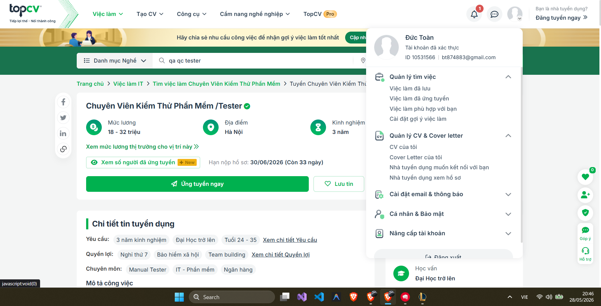
  <figcaption>Ảnh chụp màn hình tin tuyển dụng Chuyên Viên Kiểm Thử Phần
  Mềm / Tester</figcaption>
  </figure>

- **Lương:** 18 - 32 triệu/tháng

- **Mô tả công việc:**

  - Thiết kế và thực hiện kế hoạch kiểm thử, các trường hợp, kịch bản và
    quy trình kiểm thử trên các ứng dụng phần mềm dựa trên yêu cầu
    nghiệp vụ và đặc tính kỹ thuật.

  - Xác định các lỗi phần mềm để gắn cờ và chẩn đoán các lỗi và duy trì
    cơ sở dữ liệu về các lỗi phần mềm.

  - Sử dụng phân tích lịch sử các kết quả kiểm tra để xác định các vấn
    đề và các lĩnh vực cải tiến.

  - Tiến hành Kiểm tra Chức năng trên các ứng dụng mới và các cải tiến
    phần mềm hiện có để đảm bảo chúng đáp ứng các yêu cầu kinh doanh
    thông qua việc thực hiện các bài kiểm tra kịch bản kinh doanh từ đầu
    đến cuối.

  - Tiến hành Kiểm tra hồi quy trên các ứng dụng mới và các cải tiến
    phần mềm hiện có để xác định bất kỳ tác động nào có thể xảy ra do
    các thay đổi gây ra.

  - Hỗ trợ chuẩn bị và cung cấp các báo cáo về tiến độ của dịch vụ thử
    nghiệm cho các trưởng nhóm.

- **Yêu cầu kỹ năng:**

  - Tốt nghiệp Đại học trở lên chuyên ngành CNTT hoặc các ngành khác nếu
    có các chứng chỉ tương đương được công nhận bởi các tổ chức uy tín;

  - Kinh nghiệm làm việc $> 3$ năm tại các công ty, dự án về vị trí kiểm
    thử phần mềm lĩnh vực Mobile App/Web/API

  - Có kiến thức về quy trình kiểm thử phần mềm và các phương pháp, công
    cụ test, kỹ thuật test; log bug

  - Có kinh nghiệm xây dựng kịch bản kiểm thử

  - Có kinh nghiệm hỗ trợ triển khai nghiệm thu sản phẩm: viết tài liệu
    HDSD, demo hệ thống, hỗ trợ UAT, hỗ trợ vận hành

  - Có kinh nghiệm làm việc về truy vấn với các hệ cơ sở dữ liệu

  - Có khả năng và kinh nghiệm sử dụng thành thạo các công cụ: Qtest,
    Jira, Confluence,\...

- **Ảnh hưởng của AI đến công việc này:** AI giúp tự động hóa việc viết
  test scenario, tổng hợp bug report và regression testing. Tester tương
  lai cần biết sử dụng AI tools để tăng tốc kiểm thử thay vì chỉ test
  thủ công.

## 1.3 Automation/Manual Tester - Dự Án AI Giáo Dục

- **Đường dẫn:** [Job
  Posting](https://www.topcv.vn/viec-lam/automation-manual-tester-du-an-ai-giao-duc-nghi-thu-7-chu-nhat-3-nam-kinh-nghiem-thu-nhap-15-30-trieu-tai-ha-noi/2164219.html?ta_source=ButtonCopyToClipboardInJobDetail&u_sr_id=w45WaC0TZFZxne0FBqt6Aa9sHyhyB7wjJvT9rhVk_1779979702)

  <figure id="fig:job_03" data-latex-placement="htbp">
  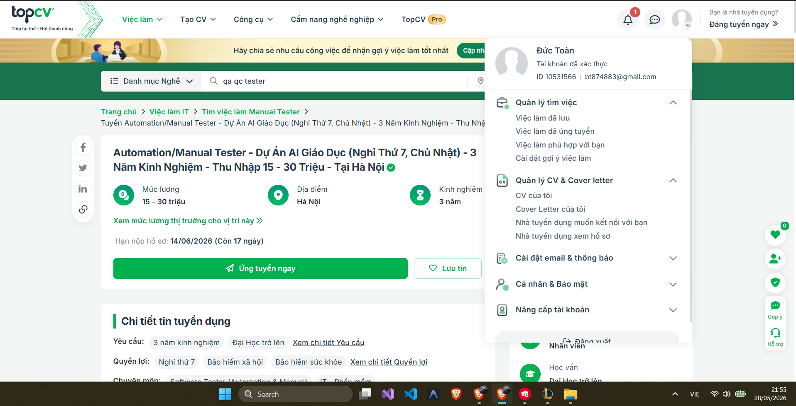
  <figcaption>Ảnh chụp màn hình tin tuyển dụng Automation/Manual Tester -
  Dự Án AI Giáo Dục</figcaption>
  </figure>

- **Lương:** 15 - 30 triệu/tháng

- **Mô tả công việc:**

  - Xây dựng test plan, thiết kế test case chi tiết dựa trên yêu cầu từ
    đội ngũ Product/BA.

  - Thực hiện kiểm thử thủ công (Functional, UI/UX, Regression) để phát
    hiện và kiểm soát lỗi hệ thống.

  - Phối hợp chặt chẽ với team Dev để theo dõi, phân tích và xử lý triệt
    để các vấn đề phát sinh.

  - Xây dựng và duy trì các kịch bản kiểm thử tự động (Automation
    scripts) cho các tính năng cốt lõi.

  - Thực thi và phân tích kết quả test tự động để đảm bảo tính ổn định
    của hệ thống trong các lần nâng cấp.

  - Biên soạn tài liệu hướng dẫn sử dụng (User Manual) và bộ câu hỏi
    thường gặp (FAQs) cho người dùng.

  - Khuyến khích ứng dụng các công cụ AI để hỗ trợ viết test case, tạo
    dữ liệu mẫu và soạn thảo tài liệu nhanh chóng.

  - Hỗ trợ đào tạo và hướng dẫn người dùng cuối (giáo viên, học sinh) sử
    dụng hệ thống hiệu quả.

  - Trực tiếp tiếp nhận phản hồi, hỗ trợ kỹ thuật và đảm bảo sự hài lòng
    của khách hàng trong quá trình vận hành.

- **Yêu cầu kỹ năng:**

  - **Kỹ năng kiểm thử (Manual + Automation)**

    - Thành thạo Playwright (ưu tiên) hoặc Selenium, có kinh nghiệm
      automation bằng Playwright API, REST Assured, Postman/Newman, hoặc
      K6.

    - Thiết kế và triển khai E2E/Regression/Smoke Automation theo mô
      hình POM hiện đại.

    - Hiểu rõ HTTP, REST, status codes, JSON/XML, DOM, selectors, async
      events, network mocking/stubbing.

    - Viết được SQL cơ bản để validate dữ liệu, biết cách debug hiệu quả
      qua browser devtools, network tracing, logs.

  - **Kỹ năng AI:**

    - Thành thạo trong việc sử dụng AI/LLM để: Sinh tự động test case,
      test scenario, test data; Phân tích root cause từ log, stack
      trace, error pattern.

    - Từng ứng dụng các công cụ/tech liên quan: Katalon AI, Playwright +
      AI IDE

  - **Kỹ năng Teamwork**

    - Thực chiến trong team Agile/Scrum, hiểu backlog refinement,
      estimation, sprint ceremony.

    - Biết làm việc chặt chẽ với BA/Dev/PO để refine requirement và đảm
      bảo chất lượng từ sớm (Shift Left).

  - **Điểm cộng**

    - Từng tham gia xây dựng QA Framework nội bộ hoặc guideline tiêu
      chuẩn test.

    - Có chứng chỉ ISTQB Foundation -- là điểm cộng nhưng không bắt
      buộc.

    - Hiểu về UI/UX Design Systems

  - **Kỹ năng mềm & thái độ**

    - Có khả năng làm việc độc lập

    - Cẩn thận và linh hoạt trong xử lý tình huống.

    - Năng động, vui vẻ, hoạt bát, chủ động, có trách nhiệm trong công
      việc.

    - Sẵn sàng học hỏi, cầu tiến, chủ động trong công việc.

    - Dễ dàng hoà nhập môi trường năng động, vui vẻ, tích cực.

    - Có khả năng chịu được áp lực trong công việc.

- **Ảnh hưởng của AI đến công việc này:** Đây là vị trí chịu ảnh hưởng
  AI rất mạnh. Vai trò QA đang chuyển dần từ manual sang AI-assisted
  testing và automation thông minh.

## 1.4 Nhân Viên QC / Tester Phần Mềm / Web Tester

- **Đường dẫn:** [Job
  Posting](https://www.topcv.vn/viec-lam/nhan-vien-qc-tester-phan-mem-web-tester/2149736.html?ta_source=JobSearchList_LinkDetail&u_sr_id=w45WaC0TZFZxne0FBqt6Aa9sHyhyB7wjJvT9rhVk_1779976920)

  <figure id="fig:job_04" data-latex-placement="htbp">
  
  <figcaption>Ảnh chụp màn hình tin tuyển dụng Nhân Viên QC / Tester Phần
  Mềm / Web Tester</figcaption>
  </figure>

- **Lương:** Thỏa thuận

- **Mô tả công việc:**

  - Phân tích yêu cầu và lập kế hoạch kiểm thử: Nắm rõ yêu cầu dự án,
    xác định phạm vi kiểm thử, lập kế hoạch và kịch bản kiểm thử (Test
    case, Test script).

  - Thực hiện kiểm thử: Tiến hành kiểm thử chức năng, giao diện, hiệu
    năng và bảo mật cho ứng dụng phần mềm và website theo kế hoạch đã đề
    ra.

  - Báo cáo và theo dõi lỗi: Ghi nhận, mô tả và báo cáo lỗi (bug) lên hệ
    thống quản lý lỗi (Jira, Redmine\...); phối hợp với đội phát triển
    để tái kiểm thử sau khi lỗi được sửa.

  - Kiểm thử hồi quy (Regression Testing): Đảm bảo các chức năng đã hoạt
    động ổn định sau khi có thay đổi hoặc cập nhật mới.

  - Tự động hóa kiểm thử (nếu có): Xây dựng và duy trì các kịch bản kiểm
    thử tự động để tối ưu quy trình test.

  - Phối hợp với các bộ phận liên quan: Làm việc chặt chẽ với BA,
    Developer, Project Manager để đảm bảo chất lượng sản phẩm.

- **Yêu cầu kỹ năng:**

  - Tốt nghiệp Cao đẳng/Đại học chuyên ngành CNTT, Hệ thống thông tin
    hoặc các ngành liên quan.

  - Có kinh nghiệm từ 1--2 năm làm Tester phần mềm hoặc Web Tester

  - Ưu tiên ứng viên đã làm dự án thực tế, ưu tiên có kinh nghiệm làm
    web Tester

  - Thành thạo quy trình kiểm thử phần mềm (AI Testing, Automation
    Testing là lợi thế).

  - Có kiến thức về HTML, CSS, cơ sở dữ liệu (SQL) là lợi thế.

  - Thành thạo công cụ test và quản lý bug (Jira, Redmine,
    TestRail\...).

  - Tư duy logic tốt, cẩn thận, tỉ mỉ, kỹ năng phân tích và giải quyết
    vấn đề.

  - Kỹ năng giao tiếp và làm việc nhóm tốt.

  - Tiếng Anh đọc -- hiểu tài liệu chuyên ngành.

- **Ảnh hưởng của AI đến công việc này:** AI hỗ trợ tăng tốc kiểm thử và
  automation testing, đặc biệt phát hiện lỗi giao diện và sinh test
  script. Cần thích nghi với AI Testing để giữ lợi thế.

## 1.5 Lead QC Engineer

- **Đường dẫn:** [Job
  Posting](https://vn.indeed.com/viewjob?jk=e75796f042d47946&from=shareddesktop_copy)

  <figure id="fig:job_05" data-latex-placement="htbp">
  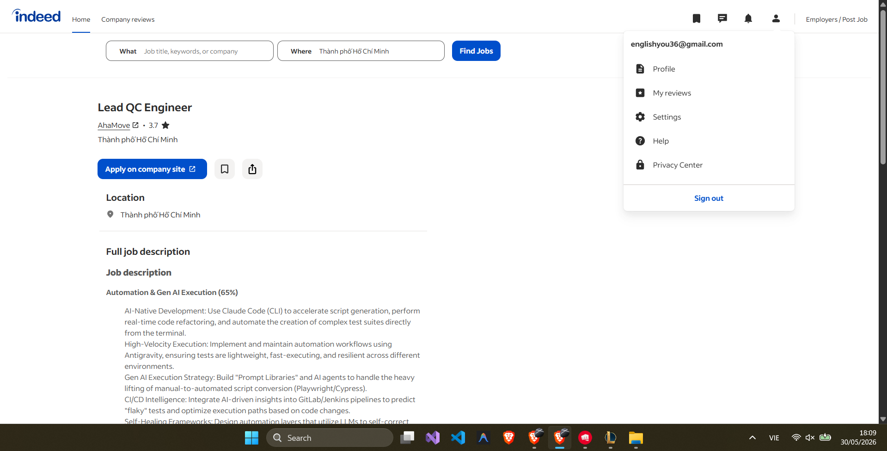
  <figcaption>Ảnh chụp màn hình tin tuyển dụng Lead QC
  Engineer</figcaption>
  </figure>

- **Lương:** Thỏa thuận

- **Mô tả công việc:**

  - **Phát triển AI gốc:** Sử dụng Claude Code (CLI) để tăng tốc tạo
    kịch bản, thực hiện tái cấu trúc mã theo thời gian thực và tự động
    tạo các bộ kiểm thử phức tạp trực tiếp từ thiết bị đầu cuối.

  - **Thực thi tốc độ cao:** Triển khai và duy trì quy trình làm việc tự
    động hóa bằng Antigravity, đảm bảo các bài kiểm thử nhẹ, thực thi
    nhanh và có khả năng phục hồi trên các môi trường khác nhau.

  - **Chiến lược thực thi AI thế hệ mới:** Xây dựng \"Thư viện nhắc
    nhở\" và các tác nhân AI để xử lý các tác vụ nặng nề của việc chuyển
    đổi kịch bản thủ công sang tự động (Playwright/Cypress).

  - **Thông minh CI/CD:** Tích hợp thông tin chi tiết dựa trên AI vào
    các pipeline GitLab/Jenkins để dự đoán các bài kiểm thử \"không ổn
    định\" và tối ưu hóa đường dẫn thực thi dựa trên các thay đổi mã.

  - **Khung tự phục hồi:** Thiết kế các lớp tự động hóa sử dụng LLM để
    tự sửa lỗi kịch bản khi các phần tử giao diện người dùng hoặc hợp
    đồng API thay đổi.

  - **Kỹ thuật quy trình làm việc:** Tái cấu trúc vòng đời QC bằng cách
    triển khai các tác nhân AI để phân loại lỗi, phân tích nhật ký và
    báo cáo lỗi tự động.

  - **Ủng hộ công nghệ:** Liên tục đánh giá sự giao thoa giữa Claude
    Code, LLM và Antigravity để giảm thiểu \"lực hấp dẫn\" (ma sát)
    trong chu kỳ phát hành.

  - **Các chỉ số hiệu quả:** Xác định và theo dõi các chỉ số
    \"AI-Lift\" - đo lường cách tích hợp AI làm giảm thời gian đưa sản
    phẩm ra thị trường và tăng phạm vi kiểm thử.

  - **\"Tư duy tự động hóa\":** Huấn luyện nhóm vượt ra ngoài việc xác
    thực thủ công, nuôi dưỡng văn hóa nơi các trợ lý AI là động lực
    chính cho hiệu quả.

  - **Sự phù hợp chiến lược:** Hợp tác với các trưởng nhóm DevOps và Kỹ
    thuật để điều chỉnh các cổng chất lượng với các chu kỳ triển khai
    nhanh chóng, \"tốc độ Antigravity\".

- **Yêu cầu kỹ năng:**

  - **Kinh nghiệm:** 5-7 năm kinh nghiệm trong lĩnh vực QA/QC, với ít
    nhất 2 năm kinh nghiệm ở vị trí Trưởng nhóm dẫn dắt các sáng kiến tự
    động hóa.

  - **Kỹ năng tự động hóa:** Thành thạo Python, JavaScript/TypeScript
    hoặc Java. Có kinh nghiệm thực tế với Playwright, Cypress hoặc
    Selenium.

  - **Công cụ nâng cao & AI:**

    - **Claude Code:** Thành thạo sử dụng CLI của Claude để lập trình
      agent, gỡ lỗi tự động và tạo script.

    - **Antigravity:** Có kinh nghiệm sử dụng Antigravity để thực thi
      kiểm thử hiệu quả cao và quản lý cơ sở hạ tầng.

    - **Kiến thức về LLM:** Thành thạo sử dụng GPT-4, Claude 3.5/4 và
      các IDE hỗ trợ AI (Cursor/GitHub Copilot).

  - **Ngăn xếp công nghệ:**

    - Kiến thức chuyên sâu về Kiểm thử API (Postman, RestAssured) và
      Microservices.

    - Thành thạo Docker/K8s và môi trường điện toán đám mây.

  - **Kỹ năng mềm:** Một người am hiểu công nghệ, có khả năng giải thích
    các quy trình làm việc AI phức tạp cho các bên liên quan và hướng
    dẫn các kỹ sư trẻ về nghệ thuật Kỹ thuật Tương tác (Prompt
    Engineering).

- **Ảnh hưởng của AI đến công việc này:** Đây gần như là vị trí QA thế
  hệ mới lấy AI làm trung tâm. QA chuyển sang vai trò quản lý hệ thống
  AI testing và pipeline CI/CD.

## 1.6 QA Engineer-Data Platform (AWS, ETL)

- **Đường dẫn:** [Job
  Posting](https://www.topcv.vn/viec-lam/qa-engineerdata-platform-aws-etl/2149906.html)

  <figure id="fig:job_06" data-latex-placement="htbp">
  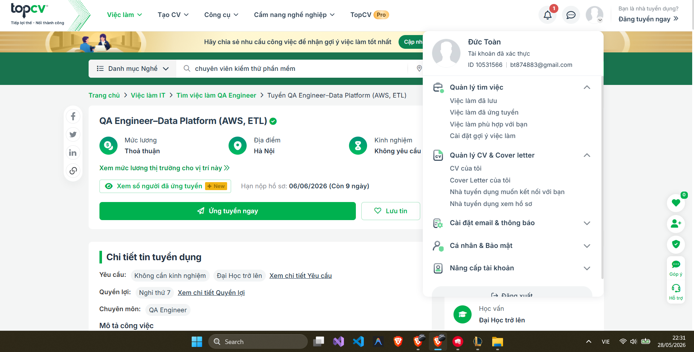
  <figcaption>Ảnh chụp màn hình tin tuyển dụng QA Engineer-Data Platform
  (AWS, ETL)</figcaption>
  </figure>

- **Lương:** Thỏa thuận

- **Mô tả công việc:**

  - Xây dựng test strategy, test plan, test scenarios/test cases cho cả
    Functional & Non-functional (hiệu năng, stress test) trong hệ thống
    dữ liệu.

  - Tham gia từ giai đoạn phân tích yêu cầu (BRD/SRS/Design) để đảm bảo
    hiểu rõ nghiệp vụ và tiêu chí chất lượng.

  - Thực hiện kiểm thử hệ thống dữ liệu: Data Warehouse, Data Lake,
    ETL/ELT pipelines, reporting systems.

  - Phối hợp với Dev/SA thực hiện SIT, Performance Test, đảm bảo chất
    lượng trước khi release.

  - Hỗ trợ Business User trong quá trình UAT và xác nhận kết quả kiểm
    thử.

  - Thực hiện kiểm tra, đối soát dữ liệu sau Go-live.

  - Quản lý và báo cáo tiến độ test, kết quả test, defect/bug.

  - Thực hiện Automation Testing (Regression) và phát triển tool/test
    script tự động.

  - Tham gia xử lý sự cố, hỗ trợ vận hành ở mức Level 3 support, xử lý
    ticket qua hệ thống IT Service Desk.

  - Chủ động đề xuất cải tiến quy trình, nâng cao chất lượng kiểm thử và
    hệ thống dữ liệu.

- **Yêu cầu kỹ năng:**

  - Kinh nghiệm kiểm thử dữ liệu (Data Testing) với Data Warehouse, Data
    Lake, Data Integration.

  - Có kinh nghiệm làm việc với môi trường AWS (data-related services)
    là lợi thế.

  - Thành thạo SQL (MSSQL, Oracle\...) và có kinh nghiệm kiểm thử
    ETL/ELT.

  - Hiểu quy trình phát triển phần mềm (Agile/Scrum).

  - Có kinh nghiệm sử dụng các công cụ quản lý test/bug (JIRA\...).

  - Kinh nghiệm xây dựng tài liệu QA: Test Plan, Test Scenario, Test
    Case, Test Report.

  - Có kinh nghiệm Automation Testing (Selenium hoặc tương đương) và
    scripting (Python/Java) là lợi thế.

  - Hiểu biết về hệ thống dữ liệu trong lĩnh vực ngân hàng (Core
    banking, thẻ, báo cáo\...) là điểm cộng.

  - Tư duy logic, phân tích tốt

  - Giao tiếp và làm việc nhóm hiệu quả

  - Cẩn thận, trách nhiệm, tuân thủ bảo mật dữ liệu

  - Chủ động trong việc phát hiện và giải quyết vấn đề.

- **Ảnh hưởng của AI đến công việc này:** AI có thể hỗ trợ kiểm tra dữ
  liệu, phát hiện bất thường và tối ưu automation test cho ETL pipeline,
  nhưng xác minh business logic vẫn cần chuyên môn QA sâu.

## 1.7 Tester (Manual/Automation)

- **Đường dẫn:** [Job
  Posting](https://www.topcv.vn/viec-lam/tester-manual-automation-thu-nhap-15-20-trieu-thang/2169805.html)

  <figure id="fig:job_07" data-latex-placement="htbp">
  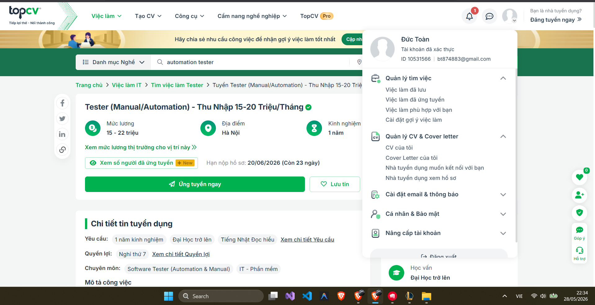
  <figcaption>Ảnh chụp màn hình tin tuyển dụng Tester
  (Manual/Automation)</figcaption>
  </figure>

- **Lương:** 15 - 22 triệu/tháng

- **Mô tả công việc:**

  - Thực hiện test case theo kế hoạch

  - Ghi nhận kết quả test đầy đủ, chính xác

  - Tạo bug report rõ ràng, có bước tái hiện, expected result và actual
    result

  - Xác nhận khả năng tái hiện lỗi

  - Tham gia review test case và phản hồi các chỉ thị

  - Bổ sung test perspective khi phát hiện thiếu coverage, phân tích
    bug, phạm vi ảnh hưởng và mức độ ưu tiên

  - Kiểm thử AI-generated code ở các góc nhìn như boundary value,
    abnormal case, exception handling và security.

- **Yêu cầu kỹ năng:**

  - Có kiến thức cơ bản về software testing

  - Có khả năng thực hiện test case theo đúng hướng dẫn

  - Biết ghi nhận kết quả test và báo cáo bug rõ ràng

  - Cẩn thận, logic, có trách nhiệm với chất lượng công việc

  - Có khả năng tự cải thiện test case và bổ sung test perspective, biết
    phân tích bug và phát hiện thiếu sót trong coverage

  - Có hiểu biết hoặc sẵn sàng học về AI-generated code, AI-generated
    test case và AI test tool.

- **Ảnh hưởng của AI đến công việc này:** Việc kiểm thử AI-generated
  code trực tiếp được đề cập trong JD. Tester phải đánh giá và validate
  chất lượng code do chính AI sinh ra.

## 1.8 QA/QC Engineer (Exp AI)

- **Đường dẫn:** [Job
  Posting](https://vn.indeed.com/viewjob?jk=0116bce400f25597&from=shareddesktop_copy)

  <figure id="fig:job_08" data-latex-placement="htbp">
  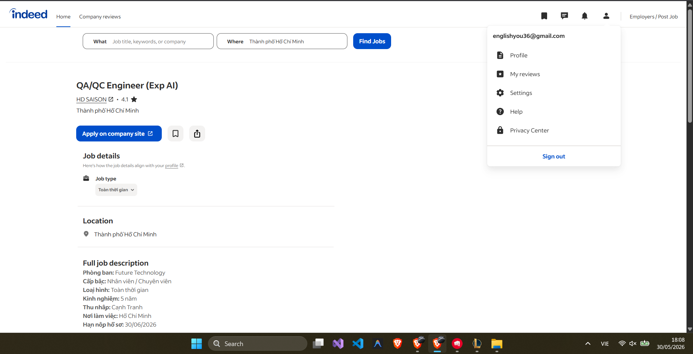
  <figcaption>Ảnh chụp màn hình tin tuyển dụng QA/QC Engineer (Exp
  AI)</figcaption>
  </figure>

- **Lương:** Thỏa thuận

- **Mô tả công việc:**

  - Xây dựng test strategy, test plan, test case cho từng sản phẩm.

  - Manual testing và test automation (UI + API).

  - Performance testing, load testing khi cần.

  - Tham gia AI evaluation: LLM output quality, prompt regression test,
    RAG accuracy, model drift detection.

  - Tạo test data, mock data cho team kỹ thuật.

- **Yêu cầu kỹ năng:**

  - Tối thiểu 5 năm kinh nghiệm QA/QC trong môi trường Agile.

  - Manual testing: viết test case, test plan, exploratory testing.

  - API testing: Postman, REST Assured, hoặc tương đương.

  - SQL cơ bản để verify data.

  - Test management tool: Jira, TestRail.

  - Bắt buộc sử dụng AI tools cho testing: Cursor, GitHub Copilot,
    Claude/ChatGPT để generate test case, test data, test script. Demo
    được workflow.

  - Có kiến thức hoặc có kinh nghiệm với LLM evaluation framework:
    DeepEval, Ragas, LangSmith, Promptfoo - là lợi thế.

  - Lộ trình chuyển đổi: sẵn sàng chuyển đổi sang AI Quality Engineer/
    LLM Evaluation Engineer trong 12-18 tháng.

  - Có kinh nghiệm Test Automation (Selenium/ Playwright/ Cypress) hoặc
    Performance Test (JMeter/ Locust/ k6) là lợi thế.

  - Đã tham gia dự án ML/AI ở bất kỳ lĩnh vực nào (test model, evaluate
    LLM output, validate data pipeline, A/B test cho AI feature, v.v.)
    là lợi thế.

  - Tỉ mỉ, có tư duy critical, biết đặt câu hỏi đúng.

  - Tiếng Anh đọc hiểu tài liệu.

- **Ảnh hưởng của AI đến công việc này:** QA tương lai sẽ tập trung
  nhiều hơn vào việc đánh giá chất lượng đầu ra của các mô hình LLM và
  RAG thay vì chỉ test phần mềm truyền thống.

## 1.9 Mid/Senior Automation QC (Playwright)

- **Đường dẫn:** [Job
  Posting](https://vn.indeed.com/viewjob?jk=2426ad9ea8b817d2&from=shareddesktop_copy)

  <figure id="fig:job_09" data-latex-placement="htbp">
  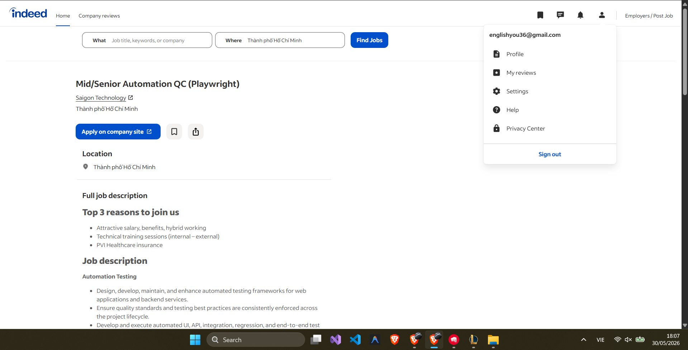
  <figcaption>Ảnh chụp màn hình tin tuyển dụng Mid/Senior Automation QC
  (Playwright)</figcaption>
  </figure>

- **Lương:** Thỏa thuận

- **Mô tả công việc:**

  - **Kiểm thử tự động**

    - Thiết kế, phát triển, duy trì và nâng cao các khung kiểm thử tự
      động cho các ứng dụng web và dịch vụ phụ trợ.

    - Đảm bảo các tiêu chuẩn chất lượng và thực tiễn kiểm thử tốt nhất
      được thực thi nhất quán trong suốt vòng đời dự án.

    - Phát triển và thực hiện các bộ kiểm thử tự động cho giao diện
      người dùng (UI), API, tích hợp, hồi quy và kiểm thử đầu cuối.

    - Mở rộng và cải thiện các khung tự động hóa kiểm soát chất lượng
      hiện có để hỗ trợ các dịch vụ và tính năng sản phẩm mới.

    - Thúc đẩy việc áp dụng khung kiểm thử đơn vị và cải thiện phạm vi
      kiểm thử tự động trên các nhóm phát triển.

  - **Kiểm thử tải và hiệu năng**

    - Thiết kế và triển khai các chiến lược kiểm thử tải, kiểm thử áp
      lực và kiểm thử hiệu năng cho các dịch vụ và API có khả năng mở
      rộng.

    - Xây dựng và duy trì các kịch bản kiểm thử hiệu năng bằng Artillery
      hoặc các công cụ tương đương.

    - Phân tích các điểm nghẽn hiệu năng và cộng tác với các nhóm kỹ
      thuật để tối ưu hóa độ tin cậy và khả năng mở rộng của hệ thống.

    - Cung cấp báo cáo kiểm thử, thông tin chi tiết và khuyến nghị dựa
      trên các chỉ số hiệu năng.

  - **Tự động hóa dựa trên AI**

    - Khám phá và triển khai các giải pháp tự động hóa hỗ trợ AI bằng
      cách sử dụng công nghệ AI tác nhân MCP và Claude.

    - Đánh giá các cơ hội để cải thiện hiệu quả kiểm thử, phạm vi tự
      động hóa và phát hiện lỗi bằng các phương pháp dựa trên AI.

    - Hỗ trợ các sáng kiến tạo kiểm thử thông minh, bảo trì tự động hóa
      và tối ưu hóa quy trình làm việc.

  - **Hợp tác & Quản trị Chất lượng**

    - Phối hợp chặt chẽ với Trưởng nhóm Kiểm soát Chất lượng tại địa
      điểm khách hàng để thống nhất chiến lược kiểm thử, khung kiểm thử
      và mục tiêu chất lượng.

    - Hợp tác với các nhà phát triển, kiến trúc sư giải pháp, kỹ sư
      DevOps và các bên liên quan đến sản phẩm để đảm bảo khả năng kiểm
      thử và sự sẵn sàng về chất lượng.

    - Tham gia vào các buổi đánh giá yêu cầu, thảo luận thiết kế kỹ
      thuật và các buổi họp sprint.

  - **CI/CD & Xuất sắc trong Kỹ thuật**

    - Tích hợp kiểm thử tự động vào các đường ống CI/CD.

    - Đảm bảo các bài kiểm thử tự động ổn định, dễ bảo trì và có khả
      năng mở rộng cho môi trường phân phối liên tục.

    - Hỗ trợ các hoạt động xác thực bản phát hành và chuẩn bị sản phẩm.

- **Yêu cầu kỹ năng:**

  - Kinh nghiệm từ 5 năm trở lên trong lĩnh vực kỹ thuật chất lượng phần
    mềm hoặc tự động hóa kiểm thử.

  - Giao tiếp tiếng Anh lưu loát.

  - Ưu tiên kinh nghiệm cấp cao trong thiết kế khung tự động hóa và các
    thực tiễn kiểm thử cấp doanh nghiệp.

  - Kinh nghiệm vững chắc trong kỹ thuật tự động hóa kiểm thử cho các
    ứng dụng web và dịch vụ.

  - Playwright để kiểm thử tự động giao diện người dùng (UI).

  - Artillery để kiểm thử tải và hiệu năng.

  - Kiểm thử tự động API.

  - Tích hợp CI/CD cho kiểm thử tự động.

  - Hiểu biết sâu sắc về các phương pháp kiểm thử phần mềm, SDLC và các
    thực tiễn tốt nhất về QA.

  - Kinh nghiệm xây dựng hoặc nâng cấp khung tự động hóa từ đầu hoặc mở
    rộng các khung cấp doanh nghiệp.

  - Kinh nghiệm với các khung kiểm thử đơn vị và các chiến lược bao phủ
    kiểm thử tự động.

  - Kỹ năng lập trình/viết kịch bản vững chắc bằng JavaScript/TypeScript
    hoặc các ngôn ngữ liên quan.

  - Kinh nghiệm với các giải pháp AI tác nhân MCP và Claude để tự động
    hóa hỗ trợ AI.

  - Kinh nghiệm với các công cụ giám sát hiệu năng và khả năng quan sát.

  - Kinh nghiệm làm việc trong môi trường Agile/Scrum.

- **Ảnh hưởng của AI đến công việc này:** AI Agents (như Claude) được
  tích hợp thẳng vào pipeline kiểm thử để cải thiện coverage và tối ưu
  workflow.

## 1.10 Senior Quality Engineer, VNGGames

- **Đường dẫn:** [Job
  Posting](https://vn.indeed.com/viewjob?jk=ce4219771cae5f6f&from=shareddesktop_copy)

  <figure id="fig:job_10" data-latex-placement="htbp">
  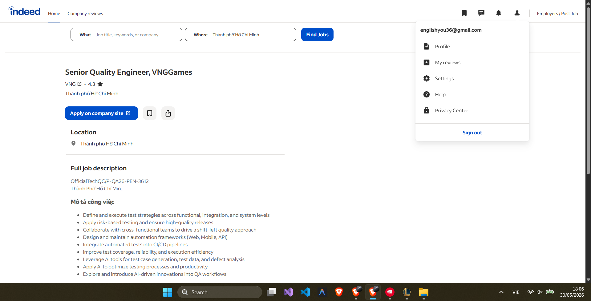
  <figcaption>Ảnh chụp màn hình tin tuyển dụng Senior Quality Engineer,
  VNGGames</figcaption>
  </figure>

- **Lương:** Thỏa thuận

- **Mô tả công việc:**

  - Xác định và thực hiện các chiến lược kiểm thử trên các cấp độ chức
    năng, tích hợp và hệ thống

  - Áp dụng kiểm thử dựa trên rủi ro và đảm bảo các bản phát hành chất
    lượng cao

  - Hợp tác với các nhóm đa chức năng để thúc đẩy phương pháp tiếp cận
    chất lượng \"chuyển sang trái\"

  - Thiết kế và duy trì các khung tự động hóa (Web, Di động, API)

  - Tích hợp các bài kiểm thử tự động vào các đường ống CI/CD

  - Cải thiện phạm vi kiểm thử, độ tin cậy và hiệu quả thực thi

  - Sử dụng các công cụ AI để tạo trường hợp kiểm thử, dữ liệu kiểm thử
    và phân tích lỗi

  - Áp dụng AI để tối ưu hóa quy trình kiểm thử và năng suất

  - Khám phá và giới thiệu các đổi mới dựa trên AI vào quy trình làm
    việc QA

- **Yêu cầu kỹ năng:**

  - Hơn 5 năm kinh nghiệm trong lĩnh vực Kiểm soát chất lượng/Kỹ thuật
    chất lượng với nền tảng kiểm thử vững chắc

  - Kinh nghiệm thực tế sử dụng các công cụ tự động hóa (Selenium,
    Playwright, Cypress, Appium, v.v.)

  - Thành thạo ít nhất một ngôn ngữ lập trình (Java, Python, JS, v.v.)

  - Kinh nghiệm với các quy trình CI/CD

  - Quen thuộc với các công cụ AI (ví dụ: Claude, Copilot) trong kiểm
    thử

  - Tư duy đặt chất lượng lên hàng đầu

  - Khả năng phân tích mạnh mẽ

  - Thái độ chủ động, sáng tạo và luôn học hỏi

- **Ảnh hưởng của AI đến công việc này:** Kỹ sư chất lượng hiện đại cần
  kết hợp automation, CI/CD và AI tools để nâng cao hiệu quả kiểm thử
  trong quy trình QA.

# Requirement 2 - 20 Software Defects 2022-2026

## 2.1 CrowdStrike Falcon Sensor Linux Kernel Panic (2024)

- **Nguồn:** [KB
  CIQ](https://kb.ciq.com/article/rocky-linux/rl-kernel-panic-crowdstrike-falcon)

- **Mô tả:** Phần mềm Falcon Sensor gây kernel panic trên Linux do lỗi
  memory corruption trong module kernel.

- **Mức độ:** Critical

- **Hậu quả:** Server Linux bị crash, downtime hệ thống container, ảnh
  hưởng production.

- **Giải pháp:** Cập nhật Falcon Sensor, rollback kernel hoặc vô hiệu
  hóa module lỗi.

## 2.2 Kubernetes CRI-O "cr8escape" CVE-2022-0811

- **Nguồn:** [CrowdStrike
  Blog](https://www.crowdstrike.com/en-us/blog/cr8escape-new-vulnerability-discovered-in-cri-o-container-engine-cve-2022-0811/)

- **Mô tả:** Lỗ hổng container escape cho phép leo thang đặc quyền từ
  container lên host Kubernetes thông qua việc lạm dụng tham số
  `kernel.core_pattern`.

- **Mức độ:** High (CVSS 8.8)

- **Hậu quả:** Kẻ tấn công có thể takeover node Kubernetes, thực thi mã
  tùy ý với quyền root và inject malware.

- **Giải pháp:** Vá CRI-O lên phiên bản 1.19.6 / 1.22.3 / 1.24.0 trở
  lên.

## 2.3 Linux Kernel CVE-2022-0185

- **Nguồn:** [NVD NIST](https://nvd.nist.gov/vuln/detail/CVE-2022-0185)

- **Mô tả:** Lỗ hổng Integer Underflow trong File System Context của
  Linux kernel dẫn đến heap-based buffer overflow, cho phép leo thang
  đặc quyền.

- **Mức độ:** High

- **Hậu quả:** Cho phép kẻ tấn công cục bộ (kể cả trong unprivileged
  container) thoát ra ngoài và lấy quyền root trên host.

- **Giải pháp:** Cập nhật Linux kernel và vô hiệu hóa unprivileged user
  namespaces.

## 2.4 OpenSSL CVE-2022-3602

- **Nguồn:** [NVD NIST](https://nvd.nist.gov/vuln/detail/CVE-2022-3602)

- **Mô tả:** Lỗ hổng 4-byte buffer overflow trong quy trình xác minh
  chứng chỉ X.509 của thư viện mã hóa OpenSSL.

- **Mức độ:** High

- **Hậu quả:** Có thể dẫn đến Remote Code Execution (RCE) hoặc Denial of
  Service (DoS) khi client xác minh một chứng chỉ độc hại.

- **Giải pháp:** Cập nhật OpenSSL lên phiên bản 3.0.7 trở lên.

## 2.5 Microsoft Exchange Server Y2K22 Bug (2022)

- **Nguồn:**
  [BleepingComputer](https://www.bleepingcomputer.com/news/microsoft/microsoft-exchange-year-2022-bug-in-fip-fs-breaks-email-delivery/)

- **Mô tả:** Lỗi tràn số nguyên (integer overflow) trong engine quét mã
  độc FIP-FS của Microsoft Exchange khi đổi sang năm 2022. Giá trị ngày
  tháng "2201010001" vượt quá giới hạn của kiểu dữ liệu `signed int32`
  (tối đa 2.147.483.647).

- **Mức độ:** High

- **Hậu quả:** Máy chủ Exchange trên toàn cầu ngừng gửi/nhận email hoàn
  toàn vào ngày 1/1/2022.

- **Giải pháp:** Microsoft phát hành script `ResetScanEngineVersion.ps1`
  để vô hiệu hóa engine lỗi và cập nhật bộ đếm metadata.

## 2.6 MOVEit Transfer SQL Injection CVE-2023-34362 (2023)

- **Nguồn:** [UpGuard](https://www.upguard.com/blog/the-moveit-0-day)

- **Mô tả:** Lỗ hổng SQL Injection nghiêm trọng trong ứng dụng web
  Progress MOVEit Transfer cho phép truy cập cơ sở dữ liệu mà không cần
  xác thực.\
  **Đáng chú ý (Ví dụ về AI Hallucination):** Khi các chuyên gia thử yêu
  cầu ChatGPT (GPT-3.5) giải thích cơ chế của lỗ hổng CVE-2023-34362
  này, AI đã bị ảo giác (hallucinate) và lập luận sai lệch hoàn toàn
  rằng đây là một \"lỗi tràn bộ đệm (buffer overflow) trong giao thức
  mạng của Linux kernel\" thay vì một lỗi SQL Injection ở tầng ứng dụng
  web.

- **Mức độ:** Critical

- **Hậu quả:** Băng đảng ransomware Cl0p đã khai thác zero-day này để
  đánh cắp dữ liệu nhạy cảm của hàng ngàn tập đoàn và cơ quan chính phủ
  trên toàn thế giới.

- **Giải pháp:** Vô hiệu hóa HTTP/HTTPS traffic, cài đặt bản vá khẩn cấp
  của Progress Software và rà soát hệ thống tìm Webshell (LEMURLOOT).

## 2.7 CrowdStrike Falcon Sensor Global Outage (Tháng 7/2024)

- **Nguồn:** [Wikipedia -- 2024 CrowdStrike-related IT
  outages](https://en.wikipedia.org/wiki/2024_CrowdStrike-related_IT_outages)

- **Mô tả:** Một tệp cấu hình lỗi (Channel File 291) được đẩy xuống cảm
  biến Falcon chạy trên hệ điều hành Windows, gây ra lỗi đọc bộ nhớ
  ngoài giới hạn (out-of-bounds memory read) dẫn đến vòng lặp Blue
  Screen of Death (BSOD).

- **Mức độ:** Critical

- **Hậu quả:** Làm sập khoảng 8,5 triệu thiết bị Windows trên toàn thế
  giới, làm tê liệt các hãng hàng không, ngân hàng và bệnh viện.

- **Giải pháp:** Phải khởi động vào Safe Mode trên từng máy tính và xóa
  tệp `C-00000291*.sys` gây lỗi thủ công.

## 2.8 AI Hallucinated Legal Citations (BC Supreme Court, 2024)

- **Nguồn:** [Clark Woods Law](https://clarkwoods.ca/blog/ai-lawyer/)

- **Mô tả:** Luật sư tại Canada nộp bản đệ trình pháp lý chứa các án lệ
  do ChatGPT tự tạo ra lên tòa án.

- **Mức độ:** High

- **Hậu quả:** Gây sai lệch pháp lý, làm mất uy tín luật sư, lãng phí
  tài nguyên của tòa án.

- **Giải pháp:** Bắt buộc kiểm chứng thủ công tất cả output của AI trước
  khi đệ trình.

## 2.9 Google AI Overview \"Glue on Pizza\" Hallucination (2024)

- **Nguồn:** [BBC News](https://www.bbc.com/news/articles/cd11gzejgz4o)

- **Mô tả:** Google AI Overview đọc dữ liệu từ Reddit/bài viết châm biếm
  và khuyên người dùng trộn keo dán vào pizza để phô mai dính tốt hơn.

- **Mức độ:** High

- **Hậu quả:** Người dùng nhận thông tin sai lệch trầm trọng và có thể
  gây nguy hiểm cho sức khỏe.

- **Giải pháp:** Google phải điều chỉnh thuật toán rào chắn (guardrails)
  và bộ lọc nguồn dữ liệu.

## 2.10 Air Canada Chatbot Misinformation Case (2024)

- **Nguồn:** [CBC
  News](https://www.cbc.ca/news/canada/british-columbia/air-canada-chatbot-lawsuit-1.7116416)

- **Mô tả:** Chatbot hỗ trợ khách hàng của Air Canada tự bịa ra chính
  sách hoàn tiền sai lệch cho hành khách khi có người thân qua đời.

- **Mức độ:** Medium

- **Hậu quả:** Air Canada bị tòa án bắt buộc phải bồi thường theo chính
  sách ảo mà AI đã hứa với khách hàng.

- **Giải pháp:** Kiểm soát chặt chẽ scope kiến thức của chatbot và tinh
  chỉnh RAG system.

## 2.11 Mark Walters v. OpenAI Defamation Lawsuit (2023)

- **Nguồn:** [First Amendment
  Watch](https://firstamendmentwatch.org/libel-lawsuit-filed-in-georgia-against-chatgpt-parent-company-openai/)

- **Mô tả:** ChatGPT bịa đặt một bản tóm tắt hồ sơ tòa án
  (hallucination), gán ghép sai sự thật rằng ông Mark Walters đã lừa đảo
  biển thủ tiền tại Second Amendment Foundation, dù ông không hề liên
  quan đến vụ việc.

- **Mức độ:** Critical

- **Hậu quả:** Gây tổn hại danh dự nghiêm trọng, dẫn đến vụ kiện bôi nhọ
  (defamation) đầu tiên đối với AI tạo sinh tại Mỹ (nộp 6/2023). Kết
  quả: OpenAI thắng kiện vào tháng 5/2025.

- **Giải pháp:** Bổ sung fact-checking và disclaimer mạnh mẽ vào AI
  outputs.

## 2.12 AI Fake Citations in Court Filings (2024)

- **Nguồn:** [Fasken
  Knowledge](https://www.fasken.com/en/knowledge/2024/03/cautionary-tales-of-using-ai-chatbots-the-courts-weigh-in-on-ai-hallucinations)

- **Mô tả:** Luật sư sử dụng chatbot dẫn nguồn án lệ hoàn toàn không tồn
  tại trong hồ sơ tố tụng.

- **Mức độ:** High

- **Hậu quả:** Dẫn đến các lệnh trừng phạt (sanctions) của tòa án và
  đánh mất niềm tin vào AI.

- **Giải pháp:** Xây dựng quy trình validation workflow bắt buộc trong
  ngành luật.

## 2.13 Mata v. Avianca Airlines - AI Fake Citations (2023)

- **Nguồn:**
  [Wikipedia](https://en.wikipedia.org/wiki/Mata_v._Avianca,_Inc.)

- **Mô tả:** Trong vụ kiện thương tích tại tòa án New York, hai luật sư
  đã đệ trình bản biện hộ được viết bằng ChatGPT với 6 vụ án pháp lý
  hoàn toàn hư cấu.

- **Mức độ:** High

- **Hậu quả:** Vụ kiện bị bác bỏ, luật sư bị phạt \$5,000 và bị bêu tên
  công khai.

- **Giải pháp:** Yêu cầu người hành nghề luật kiểm chứng thông qua cơ sở
  dữ liệu pháp lý truyền thống (Westlaw, LexisNexis).

## 2.14 California Attorney Fined for ChatGPT Fabrications (2025)

- **Nguồn:**
  [CalMatters](https://calmatters.org/economy/technology/2025/09/chatgpt-lawyer-fine-ai-regulation/)

- **Mô tả:** Luật sư Amir Mostafavi nộp một đơn kháng cáo với 21 trên
  tổng số 23 câu trích dẫn hoàn toàn do ChatGPT tự bịa ra
  (hallucination).

- **Mức độ:** High

- **Hậu quả:** Bị tòa án phạt \$10,000 vì tội nộp tài liệu ngụy tạo và
  lãng phí thời gian của tòa.

- **Giải pháp:** Các hãng luật cấm sử dụng AI chưa qua kiểm duyệt để tra
  cứu án lệ.

## 2.15 Michael Cohen's Lawyer Fake Citations via Google Bard (2023)

- **Nguồn:** [Courthouse News
  Service](https://www.courthousenews.com/michael-cohen-says-he-unknowingly-cited-cases-made-up-by-google-ai-software/)

- **Mô tả:** Luật sư của cựu luật sư tổng thống Mỹ Michael Cohen đã nộp
  các tài liệu chứa nguồn luật giả do tin tưởng mù quáng vào Google
  Bard.

- **Mức độ:** High

- **Hậu quả:** Hồ sơ bị tòa án từ chối, uy tín bị giảm sút trầm trọng và
  đứng trước nguy cơ kỷ luật.

- **Giải pháp:** Đào tạo nhận thức về rủi ro Hallucination cho người
  dùng phi kỹ thuật.

## 2.16 NEDA Chatbot 'Tessa' Harmful Advice (2023)

- **Nguồn:** [AI Incident Database -- NEDA Tessa
  Chatbot](https://incidentdatabase.ai/cite/334/)

- **Mô tả:** Chatbot 'Tessa' của Hiệp hội Rối loạn Ăn uống Quốc gia (Mỹ)
  bị lỗi dữ liệu và đưa ra lời khuyên giảm cân cực đoan cho những người
  đang mắc chứng rối loạn ăn uống.

- **Mức độ:** Critical

- **Hậu quả:** Gây rủi ro tâm lý và sức khỏe nghiêm trọng cho bệnh nhân;
  hệ thống chatbot bị gỡ bỏ lập tức.

- **Giải pháp:** Rà soát và giới hạn (hard-code) các quy tắc an toàn
  (guardrails) đối với chatbot y tế/tâm lý.

## 2.17 iTutorGroup AI Age Discrimination Bias (2023)

- **Nguồn:** [SullCrom Law Firm](https://www.sullcrom.com/insights/blogs/2023/August/EEOC-Settles-First-AI-Discrimination-Lawsuit)

- **Mô tả:** Một phần mềm tuyển dụng ứng dụng AI của iTutorGroup chứa
  thiên kiến (AI Bias), tự động loại bỏ hồ sơ của phụ nữ trên 55 tuổi và
  nam giới trên 60 tuổi.

- **Mức độ:** High

- **Hậu quả:** Bị Ủy ban Cơ hội Việc làm Bình đẳng (EEOC) khởi kiện và
  công ty phải trả 365,000 USD để dàn xếp.

- **Giải pháp:** Loại bỏ thuật toán thiên kiến và thực hiện kiểm toán
  (audit) model AI định kỳ.

## 2.18 DPD AI Chatbot Swearing and Criticizing Company (2024)

- **Nguồn:** [The Guardian](https://www.theguardian.com/technology/2024/jan/20/dpd-ai-chatbot-swears-calls-itself-useless-and-criticises-firm)

- **Mô tả:** Do một bản cập nhật lỗi, AI chatbot của hãng vận chuyển DPD
  (Anh) bị thao túng bởi người dùng (prompt injection), dẫn đến việc AI
  chửi thề và viết thơ chê bai chính dịch vụ của công ty.

- **Mức độ:** Medium

- **Hậu quả:** Làm ảnh hưởng tiêu cực đến hình ảnh thương hiệu trên mạng
  xã hội; hệ thống AI bị vô hiệu hóa.

- **Giải pháp:** Phải thiết lập filter chặt chẽ từ khóa và áp dụng các
  biện pháp phòng chống Prompt Injection.

## 2.19 Visual Hallucination in Multimodal LLMs (2024)

- **Nguồn:** [ArXiv](https://arxiv.org/abs/2403.11116)

- **Mô tả:** Các mô hình ngôn ngữ đa phương thức (MLLM) tạo ra các mô tả
  sai lệch, tự vẽ ra các đối tượng không hề tồn tại trong hình ảnh thực
  tế được cung cấp.

- **Mức độ:** Medium

- **Hậu quả:** Hệ thống nhận diện vật thể bị sai lệch, phân tích context
  không chính xác.

- **Giải pháp:** Áp dụng các benchmark dataset (như PhD Dataset) và
  reinforcement tuning để giảm thiểu ảo giác thị giác.

## 2.20 Samsung ChatGPT Confidential Data Leak (2023)

- **Nguồn:** [CS Hub -- Samsung ChatGPT Data
  Leak](https://www.cshub.com/data/news/iotw-samsung-employees-allegedly-leak-proprietary-information-via-chatgpt)

- **Mô tả:** Trong vòng chưa đầy 20 ngày sau khi Samsung Semiconductor
  cho phép nhân viên sử dụng ChatGPT, ba kỹ sư đã vô tình dán mã nguồn
  nội bộ (source code kiểm tra chip bán dẫn, thuật toán phát hiện lỗi
  sản xuất) và biên bản họp bí mật lên ChatGPT để được hỗ trợ debug và
  tóm tắt.

- **Mức độ:** High

- **Hậu quả:** Dữ liệu sở hữu trí tuệ cốt lõi của Samsung bị chuyển lên
  server của OpenAI và có thể trở thành một phần dữ liệu huấn luyện.
  Samsung phải ban hành lệnh cấm toàn công ty sử dụng generative AI vào
  tháng 5/2023 và đẩy nhanh phát triển AI nội bộ (Samsung Gauss).

- **Giải pháp:** Ban hành chính sách AI governance nội bộ, giới hạn dữ
  liệu đầu vào ChatGPT, và triển khai giải pháp LLM self-hosted để bảo
  vệ dữ liệu nhạy cảm.
## AI ảo tưởng khi chứng minh lỗi 
Model : Gemini 3.5 FLash
Prompt: "What was the exact line of code or logic error in CrowdStrike Channel File 291 that caused the BSOD? giải thích về lỗi này source code"
Output: 
- 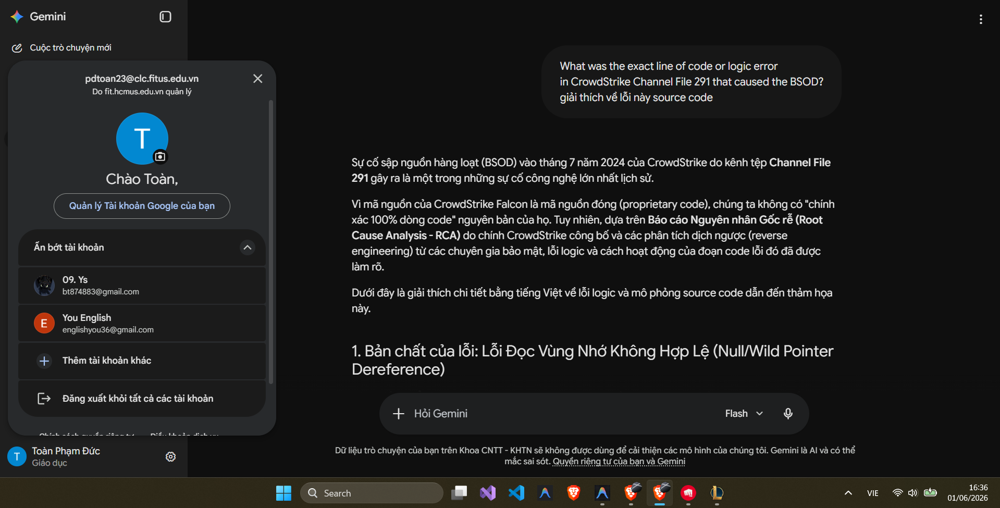
- 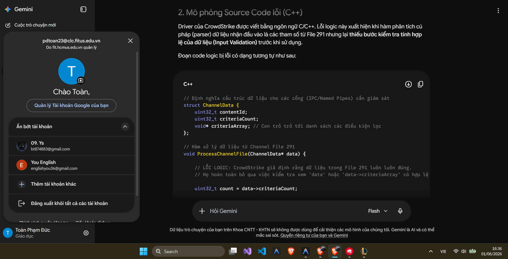
- 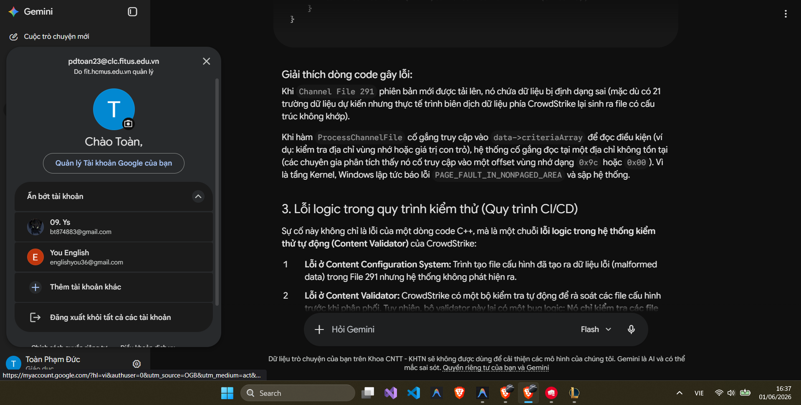
- 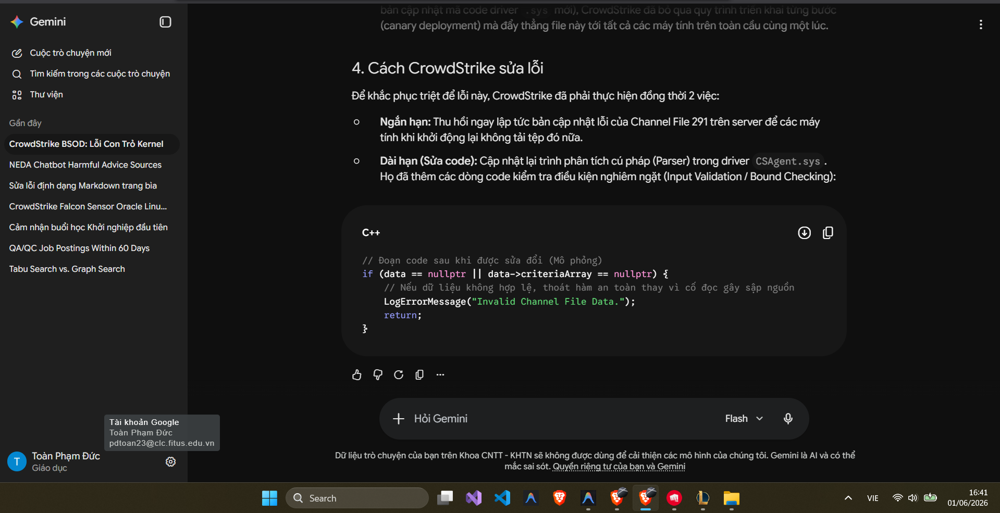

Lý do: Gemini tự thừa nhận ở ảnh 1 rằng "không có chính xác 100% dòng code" nhưng vẫn tạo ra struct, function name, memory address, và cả đoạn code fix — tất cả được trình bày như thể là sự thật kỹ thuật. Đây là hallucination có cấu trúc hoàn chỉnh (fabricated technical specificity), nguy hiểm hơn hallucination thông thường vì người đọc không có chuyên môn sẽ không thể phân biệt. Và CrowdStrike chưa bao giờ công bố source code cụ thể.
# Requirement 3 - Test cases for ONE physical product

**Sản phẩm kiểm thử:** Máy lạnh Panasonic  
**Năm sản xuất:** Không rõ  
**Số serial:** Không rõ  
**Phiên bản/Model:** Đời cũ (model inverter dân dụng)  
**Môi trường kiểm thử:** Phòng kín (~25°C ban đầu), nguồn điện 220V ổn định, điều khiển từ xa (remote) đi kèm  
**Người kiểm thử:** Phạm Đức Toàn – MSSV 23127540  
**Ngày kiểm thử:** 30/05/2026  

---

### TC-01 – Bật máy lạnh và kiểm tra hoạt động cơ bản

| Trường        | Nội dung |
|---------------|----------|
| **Objective** | Xác minh máy lạnh khởi động đúng cách và bắt đầu làm lạnh sau khi bật nguồn |
| **Input**     | Remote điều khiển có pin đầy, nguồn điện 220V, nhiệt độ phòng ban đầu ~25°C |
| **Steps**     | 1. Cắm điện vào ổ nguồn 220V. 2. Hướng remote vào máy, nhấn nút ON/OFF. 3. Quan sát đèn báo trên cục lạnh (indoor unit). 4. Lắng nghe tiếng khởi động của máy nén (compressor). 5. Cảm nhận hơi lạnh từ máy lạnh. |
| **Expected**  | Đèn báo sáng, máy phát ra tiếng khởi động bình thường; luồng khí lạnh thổi ra có nhiệt độ thấp hơn nhiệt độ phòng; không có tiếng ồn bất thường hay mùi khét. |
| **Actual**    | Máy lạnh hoạt động tốt |
| **Verdict**   | Pass &nbsp;&nbsp; |

---

### TC-02 – Tắt máy lạnh và xác minh dừng hoạt động hoàn toàn

| Trường        | Nội dung |
|---------------|----------|
| **Objective** | Xác minh máy lạnh dừng hoàn toàn (máy nén và quạt indoor dừng) sau khi nhấn OFF |
| **Input**     | Máy đang chạy ở chế độ Cool, nhiệt độ đặt 26°C |
| **Steps**     | 1. Khi máy đang hoạt động ở chế độ Cool. 2. Nhấn nút ON/OFF trên remote. 3. Quan sát đèn báo trên cục lạnh. 4. Lắng nghe xem máy nén và quạt có dừng hẳn không. 5. Chờ 2 phút và kiểm tra lại. |
| **Expected**  | Đèn báo tắt; quạt indoor và máy nén ngừng hoạt động trong vòng 60 giây; không còn luồng khí thổi ra; không còn tiếng máy chạy. |
| **Actual**    | Máy ngừng hoạt động hoàn toàn|
| **Verdict**   | Pass &nbsp;&nbsp; |

---

### TC-03 – Kiểm tra chế độ làm lạnh (Cool Mode) ở nhiệt độ tiêu chuẩn 25°C

| Trường        | Nội dung |
|---------------|----------|
| **Objective** | Xác minh máy lạnh duy trì nhiệt độ phòng ở mức cài đặt 25°C trong chế độ Cool |
| **Input**     | Remote, chế độ Cool, nhiệt độ đặt 25°C, tốc độ quạt Auto, nhiệt kế đo phòng |
| **Steps**     | 1. Bật máy, chọn chế độ Cool trên remote. 2. Đặt nhiệt độ về 25°C. 3. Bật tốc độ quạt Auto. 4. Để máy chạy liên tục 30 phút trong phòng kín. 5. Sau 30 phút, đo nhiệt độ phòng ở vị trí giữa phòng (cách cục lạnh 1.5m). |
| **Expected**  | Nhiệt độ phòng dao động trong khoảng 24°C – 26°C (±1°C so với mức cài đặt 25°C); máy nén tự điều chỉnh (inverter) để duy trì nhiệt độ ổn định. |
| **Actual**    | *(Ghi lại kết quả thực tế khi kiểm thử)* |
| **Verdict**   | ☐ Pass &nbsp;&nbsp; ☐ Fail |

---

### TC-04 – Kiểm tra nhiệt độ đặt giá trị biên thấp nhất (16°C – Boundary Value)

| Trường        | Nội dung |
|---------------|----------|
| **Objective** | Kiểm tra máy có chấp nhận và hoạt động đúng ở mức nhiệt độ thấp nhất được phép đặt (16°C) |
| **Input**     | Remote, chế độ Cool, nhiệt độ đặt 16°C, tốc độ quạt High |
| **Steps**     | 1. Bật máy, chọn chế độ Cool. 2. Nhấn nút nhiệt độ (-) liên tục đến khi màn hình remote hiển thị 16°C. 3. Thử nhấn (-) thêm một lần nữa. 4. Quan sát phản hồi trên remote và màn hình cục lạnh. 5. Để máy chạy 10 phút và đo nhiệt độ luồng khí ra. |
| **Expected**  | Remote cho phép đặt 16°C và không giảm xuống dưới; màn hình hiển thị đúng 16°C; máy chạy ở công suất tối đa; nhiệt độ luồng khí ra từ cục lạnh rất thấp (≤10°C). |
| **Actual**    | *(Ghi lại kết quả thực tế khi kiểm thử)* |
| **Verdict**   | ☐ Pass &nbsp;&nbsp; ☐ Fail |

---

### TC-05 – Kiểm tra nhiệt độ đặt giá trị biên cao nhất (30°C – Boundary Value)

| Trường        | Nội dung |
|---------------|----------|
| **Objective** | Kiểm tra máy có chấp nhận và hoạt động đúng ở mức nhiệt độ cao nhất được phép đặt (30°C) |
| **Input**     | Remote, chế độ Cool, nhiệt độ đặt 30°C, nhiệt độ phòng ~28°C |
| **Steps**     | 1. Bật máy, chọn chế độ Cool. 2. Nhấn nút (+) liên tục đến khi màn hình hiển thị 30°C. 3. Thử nhấn (+) thêm một lần nữa. 4. Để máy chạy 10 phút. 5. Quan sát hành vi máy nén khi nhiệt độ phòng thấp hơn hoặc bằng nhiệt độ cài đặt. |
| **Expected**  | Remote không cho phép tăng vượt quá 30°C; màn hình hiển thị đúng 30°C; khi nhiệt độ phòng đạt gần 30°C, máy nén tự ngắt và chỉ quạt chạy. |
| **Actual**    | *(Ghi lại kết quả thực tế khi kiểm thử)* |
| **Verdict**   | ☐ Pass &nbsp;&nbsp; ☐ Fail |

---

### TC-06 – Kiểm tra các mức tốc độ quạt (Fan Speed: Low / Medium / High / Auto)

| Trường        | Nội dung |
|---------------|----------|
| **Objective** | Xác minh tất cả các mức tốc độ quạt hoạt động đúng và tạo ra sự khác biệt lưu lượng gió rõ ràng |
| **Input**     | Remote, chế độ Cool, nhiệt độ đặt 24°C, lần lượt chọn Fan Speed: Low → Med → High → Auto |
| **Steps**     | 1. Bật máy ở chế độ Cool, nhiệt độ 24°C. 2. Đặt tốc độ quạt về Low, chờ 1 phút, cảm nhận lưu lượng gió. 3. Chuyển sang Med, chờ 1 phút, cảm nhận lưu lượng gió. 4. Chuyển sang High, chờ 1 phút. 5. Chuyển sang Auto và theo dõi . 6. Ghi nhận tiếng ồn và lưu lượng gió ở từng mức. |
| **Expected**  | Lưu lượng gió tăng rõ rệt theo thứ tự Low < Med < High; ở chế độ Auto máy tự điều chỉnh tốc độ quạt theo nhiệt độ phòng; không có tiếng kêu lạ ở bất kỳ mức nào. |
| **Actual**    | *(Ghi lại kết quả thực tế khi kiểm thử)* |
| **Verdict**   | ☐ Pass &nbsp;&nbsp; ☐ Fail |

---

### TC-07 – Kiểm tra chức năng hẹn giờ tắt (Sleep Timer)

| Trường        | Nội dung |
|---------------|----------|
| **Objective** | Xác minh máy lạnh tự động tắt sau khoảng thời gian đã được hẹn giờ |
| **Input**     | Remote, chế độ Cool, hẹn giờ tắt 1 giờ (Timer Off = 1h), đồng hồ bấm giờ |
| **Steps**     | 1. Bật máy, chọn chế độ Cool, nhiệt độ 25°C. 2. Nhấn nút Timer/Sleep trên remote, đặt thời gian tắt sau 1 giờ. 3. Xác nhận màn hình hiển thị "1h" hoặc biểu tượng timer. 4. Bắt đầu bấm đồng hồ. 5. Sau 60 phút, kiểm tra xem máy đã tự tắt chưa. |
| **Expected**  | Sau đúng 60 phút (±2 phút), máy tự động tắt; đèn báo tắt; quạt và máy nén ngừng hoàn toàn; không cần tác động thủ công. |
| **Actual**    | *(Ghi lại kết quả thực tế khi kiểm thử)* |
| **Verdict**   | ☐ Pass &nbsp;&nbsp; ☐ Fail |

---

### TC-08 – Kiểm tra chế độ ngủ (Sleep Mode)

| Trường        | Nội dung |
|---------------|----------|
| **Objective** | Xác minh chế độ Sleep tự động tăng nhiệt độ theo thời gian và giảm độ sáng đèn để không làm phiền giấc ngủ |
| **Input**     | Remote, chế độ Sleep (hoặc nút Sleep), nhiệt độ ban đầu đặt 26°C, nhiệt kế phòng |
| **Steps**     | 1. Bật máy, chọn chế độ Cool, nhiệt độ 26°C. 2. Nhấn nút Sleep trên remote. 3. Quan sát đèn báo trên cục lạnh (có giảm sáng không). 4. Sau 30 phút, kiểm tra nhiệt độ cài đặt trên remote xem có tự tăng thêm 1°C không. 5. Theo dõi thêm 30 phút tiếp theo. |
| **Expected**  | Đèn hiển thị trên cục lạnh tối đi hoặc tắt; nhiệt độ cài đặt tự động tăng thêm 1°C sau mỗi giờ (theo cơ chế Sleep của Panasonic); tiếng máy êm hơn so với chế độ Cool thông thường. |
| **Actual**    | *(Ghi lại kết quả thực tế khi kiểm thử)* |
| **Verdict**   | ☐ Pass &nbsp;&nbsp; ☐ Fail |

---

### TC-09 – Kiểm tra điều khiển từ xa hoạt động ở khoảng cách tối đa (~8m)

| Trường        | Nội dung |
|---------------|----------|
| **Objective** | Xác minh remote điều khiển vẫn hoạt động chính xác ở khoảng cách tối đa được nhà sản xuất quy định (~8m) |
| **Input**     | Remote có pin đầy, máy lạnh đang tắt, phòng không có vật cản giữa remote và cục lạnh |
| **Steps**     | 1. Đứng cách cục lạnh khoảng 8m, hướng thẳng remote về phía đầu thu hồng ngoại. 2. Nhấn ON/OFF. 3. Quan sát máy có phản hồi không (đèn sáng, tiếng beep). 4. Thử chỉnh nhiệt độ và tốc độ quạt từ khoảng cách này. 5. Lặp lại 3 lần. |
| **Expected**  | Máy lạnh nhận lệnh và phản hồi đúng (đèn sáng, beep xác nhận) trong cả 3 lần thử ở khoảng cách 8m; các lệnh điều chỉnh nhiệt độ và quạt được thực thi chính xác. |
| **Actual**    | *(Ghi lại kết quả thực tế khi kiểm thử)* |
| **Verdict**   | ☐ Pass &nbsp;&nbsp; ☐ Fail |

---

### TC-10 – Kiểm tra tiếng ồn và rung động bất thường khi hoạt động liên tục (2 giờ)

| Trường        | Nội dung |
|---------------|----------|
| **Objective** | Đảm bảo máy lạnh không phát ra tiếng ồn, rung động hay mùi bất thường sau khi hoạt động liên tục 2 giờ |
| **Input**     | Chế độ Cool, nhiệt độ 24°C, tốc độ quạt High, ứng dụng đo tiếng ồn trên điện thoại (dB meter) |
| **Steps**     | 1. Bật máy ở chế độ Cool, 24°C, quạt High. 2. Đo tiếng ồn ban đầu bằng ứng dụng dB meter ở khoảng cách 1m. 3. Để máy chạy liên tục 2 giờ. 4. Sau 2 giờ, đo tiếng ồn lại và nghe có tiếng lạ (rền, rít, lộc cộc) không. 5. Quan sát xem có hơi nước ngưng tụ bất thường chảy ra không. |
| **Expected**  | Tiếng ồn dưới 45 dB ở khoảng cách 1m; không có tiếng rền, rít, hoặc lộc cộc; không có mùi khét hay mùi lạ; không có nước nhỏ giọt bất thường từ cục lạnh vào phòng. |
| **Actual**    | *(Ghi lại kết quả thực tế khi kiểm thử)* |
| **Verdict**   | ☐ Pass &nbsp;&nbsp; ☐ Fail |

---

### TC-11 – Kiểm tra chế độ tự động (Auto Mode) tự điều chỉnh theo nhiệt độ phòng

| Trường        | Nội dung |
|---------------|----------|
| **Objective** | Xác minh chế độ Auto tự động lựa chọn giữa làm lạnh/quạt và điều chỉnh công suất phù hợp với nhiệt độ phòng thực tế |
| **Input**     | Remote, chế độ Auto, nhiệt độ đặt 25°C, nhiệt kế phòng, nhiệt độ phòng ban đầu ~30°C (phòng nóng) |
| **Steps**     | 1. Tắt máy lạnh và để phòng đạt ~30°C trước khi test. 2. Bật máy, chọn chế độ Auto, đặt nhiệt độ 25°C. 3. Quan sát máy tự chọn chế độ làm việc (Cool hay Fan). 4. Theo dõi trong 20 phút khi phòng đang nguội dần. 5. Khi nhiệt độ phòng đạt 25°C, quan sát hành vi của máy nén. |
| **Expected**  | Ở 30°C, máy tự chọn chế độ Cool và chạy máy nén; khi nhiệt độ phòng tiến gần 25°C, máy nén tự điều chỉnh giảm công suất (inverter) hoặc ngắt; màn hình hiển thị đúng chế độ Auto. |
| **Actual**    | *(Ghi lại kết quả thực tế khi kiểm thử)* |
| **Verdict**   | ☐ Pass &nbsp;&nbsp; ☐ Fail |

---
### TC-12 - Kiểm tra khi máy lạnh đang chạy thì bị cúp điện

| Trường        | Nội dung |
|---------------|----------|
| **Objective** | Xác minh chức năng tự khởi động lại sau khi có điện lại, và máy tiếp tục hoạt động theo chế độ cài đặt trước khi bị mất điện |
| **Input**     | Remote, chế độ Cool, nhiệt độ 25°C, đồng hồ bấm giờ, nguồn điện nhà |
| **Steps**     | 1. Bật máy lạnh ở chế độ Cool, 25°C và để máy chạy ổn định trong 5 phút. 2. Rút phích cắm đột ngột để mô phỏng cúp điện. 3. Chờ 1 phút. 4. Bật lại điện. 5. Quan sát hành vi khởi động của máy. 6. Kiểm tra xem máy có tự động bật lại theo chế độ đã cài trước đó không (tùy model có chức năng này). |
| **Expected**  | Máy tự động bật lại sau khi có điện (nếu có chức năng Auto Restart). Nếu không có chức năng tự khởi động, máy không hoạt động và yêu cầu người dùng bật lại thủ công. |
| **Actual**    | *(Ghi lại kết quả thực tế khi kiểm thử)* |
| **Verdict**   | ☐ Pass &nbsp;&nbsp; ☐ Fail |

---

### TC-13 - Kiểm tra khi máy lạnh đang hoạt động thì remote hết pin hoặc bị mất tín hiệu

| Trường        | Nội dung |
|---------------|----------|
| **Objective** | Xác minh chức năng điều khiển từ xa (remote) hoạt động đúng và máy vẫn duy trì chế độ cài đặt khi remote hết pin hoặc mất tín hiệu |
| **Input**     | Remote, chế độ Cool, nhiệt độ 25°C, pin remote mới, pin remote hết, vật cản tín hiệu |
| **Steps**     | 1. Bật máy lạnh ở chế độ Cool, 25°C và để máy chạy ổn định. 2. Tháo pin remote để mô phỏng remote hết pin/mất tín hiệu. 3. Quan sát máy hoạt động. 4. Kiểm tra xem máy lạnh có tiếp tục hoạt động theo chế độ đã cài đặt trước đó không. |
| **Expected**  | Máy vẫn tiếp tục hoạt động theo chế độ đã cài đặt trước khi remote hết pin hoặc bị mất tín hiệu; nếu có nút bấm thủ công trên cục lạnh, người dùng có thể sử dụng nút này để điều khiển máy. |
| **Actual**    | Máy vẫn tiếp tục hoạt động theo chế độ đã cài đặt trước khi remote hết pin hoặc bị mất tín hiệu |
| **Verdict**   | Pass &nbsp;&nbsp;  |

---

### TC-14 - Kiểm tra chế độ chức năng Air Swing

| Trường        | Nội dung |
|---------------|----------|
| **Objective** | Xác minh chức năng Air Swing hoạt động đúng |
| **Input**     | Remote, chế độ Air Swing, nhiệt độ 25°C |
| **Steps**     | 1. Bật máy lạnh ở chế độ Cool, 25°C và để máy chạy ổn định. 2. Nhấn nút Air Swing trên remote. 3. Quan sát xem các lá đảo gió tự động di chuyển lên xuống |
| **Expected**  | Các lá đảo gió tự động di chuyển lên xuống |
| **Actual**    | Các lá gió di chuyển lên xuống |
| **Verdict**   | Pass &nbsp;&nbsp;  |

---

### TC-15 Kiểm tra máy lạnh không phản hồi khi hướng remote xuống dưới

| Trường        | Nội dung |
|---------------|----------|
| **Objective** | Xác minh remote điều khiển không hoạt động chính xác khi hướng remote xuống dưới |
| **Input**     | Remote có pin đầy, máy lạnh đang tắt, hướng remote xuống dưới |
| **Steps**     | 1. Đứng cách cục lạnh 2m, hướng remote xuống dưới. 2. Nhấn ON/OFF. 3. Quan sát máy không có phản hồi (đèn không sáng). 4. Thử chỉnh nhiệt độ và tốc độ quạt từ khoảng cách này. |
| **Expected**  | Máy lạnh không nhận lệnh; các lệnh điều chỉnh nhiệt độ và quạt không được thực thi. |
| **Actual**    | Máy lạnh không nhận lệnh |
| **Verdict**   | Pass &nbsp;&nbsp;  |

---

# AI Audit Report
## **3\. Bảng Audit — 1 hàng / artifact**
| (1) Prompt \+ Công cụ | (2) Output AI | (3) Verdict | (4) Lý do (ISTQB) | (5) Bản SV sửa |
| :---- | :---- | :---- | :---- | :---- |
|**11 Test Cases — Máy lạnh Panasonic** **Tool:** Claude Sonnet 4.6 (Thinking) — Antigravity **Thời gian:** 4:56 PM 31/05/2026 **Prompt:** "Design 11 test cases (Objective / Input / Steps / Expected / Actual / Verdict). Design 11 test cases cho máy lạnh Panasonic" | **✅ 11 Test Cases — Máy lạnh Panasonic**  \| TC \| Tên test case \| Kỹ thuật kiểm thử \| \|----\|-----------\|----\| \| TC-01 \| Bật máy lạnh và kiểm tra hoạt động cơ bản \| Functional \| \| TC-02 \| Tắt máy lạnh, xác minh dừng hoàn toàn \| Functional \| \| TC-03 \| Chế độ Cool ở 25°C tiêu chuẩn \| Functional \| \| TC-04 \| Nhiệt độ biên thấp nhất **16°C** \| Boundary Value \| \| TC-05 \| Nhiệt độ biên cao nhất **30°C** \| Boundary Value \| \| TC-06 \| Các mức tốc độ quạt (Low / Med / High / Auto) \| Functional \| \| TC-07 \| Hẹn giờ tắt (Sleep Timer – 1 giờ) \| Functional \| \| TC-08 \| Chế độ ngủ Sleep Mode \| Functional \| \| TC-09 \| Remote hoạt động ở khoảng cách tối đa ~8m \| Functional / Usability \| \| TC-10 \| Tiếng ồn & rung động khi chạy liên tục 2 giờ \| Reliability / Safety \| \| TC-11 \| Chế độ tự động (Auto Mode) \| Functional \|  **File Change — AI trực tiếp edit report.md**  **TC-01 – Bật máy lạnh và kiểm tra hoạt động cơ bản** **Objective:** Xác minh máy lạnh khởi động đúng cách và bắt đầu làm lạnh sau khi bật nguồn **Input:** Remote điều khiển có pin đầy, nguồn điện 220V, nhiệt độ phòng ban đầu ~25°C **Steps:** 1. Cắm điện vào ổ nguồn 220V. 2. Hướng remote vào máy, nhấn nút ON/OFF. 3. Quan sát đèn báo trên cục lạnh (indoor unit). 4. Lắng nghe tiếng khởi động của máy nén (compressor). 5. Cảm nhận hơi lạnh từ máy lạnh. **Expected:** Đèn báo sáng, máy phát ra tiếng khởi động bình thường; luồng khí lạnh thổi ra có nhiệt độ thấp hơn nhiệt độ phòng; không có tiếng ồn bất thường hay mùi khét. **Actual:** *(Ghi lại kết quả thực tế khi kiểm thử)* **Verdict:** ☐ Pass ☐ Fail  **TC-02 – Tắt máy lạnh và xác minh dừng hoạt động hoàn toàn** **Objective:** Xác minh máy lạnh dừng hoàn toàn (máy nén và quạt indoor dừng) sau khi nhấn OFF **Input:** Máy đang chạy ở chế độ Cool, nhiệt độ đặt 26°C **Steps:** 1. Khi máy đang hoạt động ở chế độ Cool. 2. Nhấn nút ON/OFF trên remote. 3. Quan sát đèn báo trên cục lạnh. 4. Lắng nghe xem máy nén và quạt có dừng hẳn không. 5. Chờ 2 phút và kiểm tra lại. **Expected:** Đèn báo tắt; quạt indoor và máy nén ngừng hoạt động trong vòng 60 giây; không còn luồng khí thổi ra; không còn tiếng máy chạy. **Actual:** *(Ghi lại kết quả thực tế khi kiểm thử)* **Verdict:** ☐ Pass ☐ Fail  **TC-03 – Kiểm tra chế độ làm lạnh (Cool Mode) ở nhiệt độ tiêu chuẩn 25°C** **Objective:** Xác minh máy lạnh duy trì nhiệt độ phòng ở mức cài đặt 25°C trong chế độ Cool **Input:** Remote, chế độ Cool, nhiệt độ đặt 25°C, tốc độ quạt Auto, nhiệt kế đo phòng **Steps:** 1. Bật máy, chọn chế độ Cool trên remote. 2. Đặt nhiệt độ về 25°C. 3. Bật tốc độ quạt Auto. 4. Để máy chạy liên tục 30 phút trong phòng kín. 5. Sau 30 phút, đo nhiệt độ phòng ở vị trí giữa phòng (cách cục lạnh 1.5m). **Expected:** Nhiệt độ phòng dao động trong khoảng 24°C – 26°C (±1°C so với mức cài đặt 25°C); máy nén tự điều chỉnh (inverter) để duy trì nhiệt độ ổn định. **Actual:** *(Ghi lại kết quả thực tế khi kiểm thử)* **Verdict:** ☐ Pass ☐ Fail  **TC-04 – Kiểm tra nhiệt độ đặt giá trị biên thấp nhất (16°C – Boundary Value)** **Objective:** Kiểm tra máy có chấp nhận và hoạt động đúng ở mức nhiệt độ thấp nhất được phép đặt (16°C) **Input:** Remote, chế độ Cool, nhiệt độ đặt 16°C, tốc độ quạt High **Steps:** 1. Bật máy, chọn chế độ Cool. 2. Nhấn nút nhiệt độ (-) liên tục đến khi màn hình remote hiển thị 16°C. 3. Thử nhấn (-) thêm một lần nữa. 4. Quan sát phản hồi trên remote và màn hình cục lạnh. 5. Để máy chạy 10 phút và đo nhiệt độ luồng khí ra. **Expected:** Remote cho phép đặt 16°C và không giảm xuống dưới; màn hình hiển thị đúng 16°C; máy chạy ở công suất tối đa; nhiệt độ luồng khí ra từ cục lạnh rất thấp (≤10°C). **Actual:** *(Ghi lại kết quả thực tế khi kiểm thử)* **Verdict:** ☐ Pass ☐ Fail  **TC-05 – Kiểm tra nhiệt độ đặt giá trị biên cao nhất (30°C – Boundary Value)** **Objective:** Kiểm tra máy có chấp nhận và hoạt động đúng ở mức nhiệt độ cao nhất được phép đặt (30°C) **Input:** Remote, chế độ Cool, nhiệt độ đặt 30°C, nhiệt độ phòng ~28°C **Steps:** 1. Bật máy, chọn chế độ Cool. 2. Nhấn nút (+) liên tục đến khi màn hình hiển thị 30°C. 3. Thử nhấn (+) thêm một lần nữa. 4. Để máy chạy 10 phút. 5. Quan sát hành vi máy nén khi nhiệt độ phòng thấp hơn hoặc bằng nhiệt độ cài đặt. **Expected:** Remote không cho phép tăng vượt quá 30°C; màn hình hiển thị đúng 30°C; khi nhiệt độ phòng đạt gần 30°C, máy nén tự ngắt và chỉ quạt chạy. **Actual:** *(Ghi lại kết quả thực tế khi kiểm thử)* **Verdict:** ☐ Pass ☐ Fail  **TC-06 – Kiểm tra các mức tốc độ quạt (Fan Speed: Low / Medium / High / Auto)** **Objective:** Xác minh tất cả các mức tốc độ quạt hoạt động đúng và tạo ra sự khác biệt lưu lượng gió rõ ràng **Input:** Remote, chế độ Cool, nhiệt độ đặt 24°C, lần lượt chọn Fan Speed: Low → Med → High → Auto **Steps:** 1. Bật máy ở chế độ Cool, nhiệt độ 24°C. 2. Đặt tốc độ quạt về Low, chờ 1 phút, cảm nhận lưu lượng gió. 3. Chuyển sang Med, chờ 1 phút, cảm nhận lưu lượng gió. 4. Chuyển sang High, chờ 1 phút. 5. Chuyển sang Auto và theo dõi. 6. Ghi nhận tiếng ồn và lưu lượng gió ở từng mức. **Expected:** Lưu lượng gió tăng rõ rệt theo thứ tự Low < Med < High; ở chế độ Auto máy tự điều chỉnh tốc độ quạt theo nhiệt độ phòng; không có tiếng kêu lạ ở bất kỳ mức nào. **Actual:** *(Ghi lại kết quả thực tế khi kiểm thử)* **Verdict:** ☐ Pass ☐ Fail  **TC-07 – Kiểm tra chức năng hẹn giờ tắt (Sleep Timer)** **Objective:** Xác minh máy lạnh tự động tắt sau khoảng thời gian đã được hẹn giờ **Input:** Remote, chế độ Cool, hẹn giờ tắt 1 giờ (Timer Off = 1h), đồng hồ bấm giờ **Steps:** 1. Bật máy, chọn chế độ Cool, nhiệt độ 25°C. 2. Nhấn nút Timer/Sleep trên remote, đặt thời gian tắt sau 1 giờ. 3. Xác nhận màn hình hiển thị "1h" hoặc biểu tượng timer. 4. Bắt đầu bấm đồng hồ. 5. Sau 60 phút, kiểm tra xem máy đã tự tắt chưa. **Expected:** Sau đúng 60 phút (±2 phút), máy tự động tắt; đèn báo tắt; quạt và máy nén ngừng hoàn toàn; không cần tác động thủ công. **Actual:** *(Ghi lại kết quả thực tế khi kiểm thử)* **Verdict:** ☐ Pass ☐ Fail  **TC-08 – Kiểm tra chế độ ngủ (Sleep Mode)** **Objective:** Xác minh chế độ Sleep tự động tăng nhiệt độ theo thời gian và giảm độ sáng đèn để không làm phiền giấc ngủ **Input:** Remote, chế độ Sleep (hoặc nút Sleep), nhiệt độ ban đầu đặt 26°C, nhiệt kế phòng **Steps:** 1. Bật máy, chọn chế độ Cool, nhiệt độ 26°C. 2. Nhấn nút Sleep trên remote. 3. Quan sát đèn báo trên cục lạnh (có giảm sáng không). 4. Sau 30 phút, kiểm tra nhiệt độ cài đặt trên remote xem có tự tăng thêm 1°C không. 5. Theo dõi thêm 30 phút tiếp theo. **Expected:** Đèn hiển thị trên cục lạnh tối đi hoặc tắt; nhiệt độ cài đặt tự động tăng thêm 1°C sau mỗi giờ (theo cơ chế Sleep của Panasonic); tiếng máy êm hơn so với chế độ Cool thông thường. **Actual:** *(Ghi lại kết quả thực tế khi kiểm thử)* **Verdict:** ☐ Pass ☐ Fail  **TC-09 – Kiểm tra điều khiển từ xa hoạt động ở khoảng cách tối đa (~8m)** **Objective:** Xác minh remote điều khiển vẫn hoạt động chính xác ở khoảng cách tối đa được nhà sản xuất quy định (~8m) **Input:** Remote có pin đầy, máy lạnh đang tắt, phòng không có vật cản giữa remote và cục lạnh **Steps:** 1. Đứng cách cục lạnh khoảng 8m, hướng thẳng remote về phía đầu thu hồng ngoại. 2. Nhấn ON/OFF. 3. Quan sát máy có phản hồi không (đèn sáng, tiếng beep). 4. Thử chỉnh nhiệt độ và tốc độ quạt từ khoảng cách này. 5. Lặp lại 3 lần. **Expected:** Máy lạnh nhận lệnh và phản hồi đúng (đèn sáng, beep xác nhận) trong cả 3 lần thử ở khoảng cách 8m; các lệnh điều chỉnh nhiệt độ và quạt được thực thi chính xác. **Actual:** *(Ghi lại kết quả thực tế khi kiểm thử)* **Verdict:** ☐ Pass ☐ Fail  **TC-10 – Kiểm tra tiếng ồn và rung động bất thường khi hoạt động liên tục (2 giờ)** **Objective:** Đảm bảo máy lạnh không phát ra tiếng ồn, rung động hay mùi bất thường sau khi hoạt động liên tục 2 giờ **Input:** Chế độ Cool, nhiệt độ 24°C, tốc độ quạt High, ứng dụng đo tiếng ồn trên điện thoại (dB meter) **Steps:** 1. Bật máy ở chế độ Cool, 24°C, quạt High. 2. Đo tiếng ồn ban đầu bằng ứng dụng dB meter ở khoảng cách 1m. 3. Để máy chạy liên tục 2 giờ. 4. Sau 2 giờ, đo tiếng ồn lại và nghe có tiếng lạ (rền, rít, lộc cộc) không. 5. Quan sát xem có hơi nước ngưng tụ bất thường chảy ra không. **Expected:** Tiếng ồn dưới 45 dB ở khoảng cách 1m; không có tiếng rền, rít, hoặc lộc cộc; không có mùi khét hay mùi lạ; không có nước nhỏ giọt bất thường từ cục lạnh vào phòng. **Actual:** *(Ghi lại kết quả thực tế khi kiểm thử)* **Verdict:** ☐ Pass ☐ Fail  **TC-11 – Kiểm tra chế độ tự động (Auto Mode) tự điều chỉnh theo nhiệt độ phòng** **Objective:** Xác minh chế độ Auto tự động lựa chọn giữa làm lạnh/quạt và điều chỉnh công suất phù hợp với nhiệt độ phòng thực tế **Input:** Remote, chế độ Auto, nhiệt độ đặt 25°C, nhiệt kế phòng, nhiệt độ phòng ban đầu ~30°C (phòng nóng) **Steps:** 1. Tắt máy lạnh và để phòng đạt ~30°C trước khi test. 2. Bật máy, chọn chế độ Auto, đặt nhiệt độ 25°C. 3. Quan sát máy tự chọn chế độ làm việc (Cool hay Fan). 4. Theo dõi trong 20 phút khi phòng đang nguội dần. 5. Khi nhiệt độ phòng đạt 25°C, quan sát hành vi của máy nén. **Expected:** Ở 30°C, máy tự chọn chế độ Cool và chạy máy nén; khi nhiệt độ phòng tiến gần 25°C, máy nén tự điều chỉnh giảm công suất (inverter) hoặc ngắt; màn hình hiển thị đúng chế độ Auto. **Actual:** *(Ghi lại kết quả thực tế khi kiểm thử)* **Verdict:** ☐ Pass ☐ Fail | INCOMPLETE | AI sinh đúng cấu trúc 6 trường, đúng kỹ thuật kiểm thử theo đặc tả máy lạnh Panasonic Inverter. Nhưng phần Actual và Verdict thì chưa được xác thực. | Điền Actual Result cho TC-01 – TC-2 sau khi thực hiện kiểm thử thực tế. |
| **QA/QC Role Mindmap** **Tool:** Gemini 3.1 Pro **Thời gian:** 13:35 31/05/2026 **Prompt lần 1:** "# 1 Requirement 1 - Thị trường việc làm QA/QC 2026+ ## 1.1 QC Mid-Senior Đường dẫn: https://www.topcv.vn/viec-lam/qc-mid-senior/2161770.html Lương: 14 - 20 triệu/tháng Mô tả: Nghiên cứu tài liệu yêu cầu (BRD/FS). Thiết kế test case, test scenario. Thực hiện Functional/Regression/Re-test. Log lỗi trên Redmine. Theo dõi tiến độ fix. Kiểm tra dữ liệu bằng SQL. Test API bằng Postman. Phối hợp Dev/BA. Kỹ năng: Manual Testing, Test Case/Scenario, Bug Tracking & Bug Lifecycle, SQL, Postman, Redmine, ISTQB, Teamwork Dev/BA, Logical Thinking/Attention to Detail. ## 1.2 Chuyên Viên Kiểm Thử Phần Mềm / Tester Đường dẫn: https://www.topcv.vn/viec-lam/chuyen-vien-kiem-thu-phan-mem-tester/1713391.html Lương: 18 - 32 triệu/tháng Mô tả: Thiết kế kế hoạch kiểm thử, kịch bản, quy trình. Xác định và duy trì cơ sở dữ liệu lỗi. Phân tích lịch sử kết quả test. Kiểm tra chức năng E2E. Regression testing. Kỹ năng: ĐH CNTT, >3 năm, Mobile App/Web/API, Qtest/Jira/Confluence. ## 1.3 Automation/Manual Tester - Dự Án AI Giáo Dục Đường dẫn: https://www.topcv.vn/viec-lam/automation-manual-tester-du-an-ai-giao-duc... Lương: 15 - 30 triệu/tháng Kỹ năng: Playwright/Selenium, POM, E2E/Regression/Smoke Automation, HTTP/REST/JSON/XML, SQL, AI/LLM (sinh test case, test data, phân tích root cause), Katalon AI, Agile/Scrum Shift-Left, ISTQB là điểm cộng. ## 1.4 Nhân Viên QC / Tester Phần Mềm / Web Tester Đường dẫn: https://www.topcv.vn/viec-lam/nhan-vien-qc-tester-phan-mem-web-tester/2149736.html Lương: Thỏa thuận Kỹ năng: 1-2 năm kinh nghiệm, Jira/Redmine/TestRail, HTML/CSS/SQL, AI Testing/Automation Testing là lợi thế. ## 1.5 Lead QC Engineer Đường dẫn: https://vn.indeed.com/viewjob?jk=e75796f042d47946 Lương: Thỏa thuận Mô tả: Dùng Claude Code (CLI). Dùng Antigravity. Xây dựng Prompt Library & AI Agents. CI/CD thông minh GitLab/Jenkins. Self-healing framework với LLM. AI-Lift metrics. Kỹ năng: 5-7 năm QA/QC, Playwright/Cypress/Selenium, Python/JS/TS/Java, Claude Code CLI, Antigravity, GPT-4/Claude 3.5/4, Docker/K8s, Prompt Engineering. ## 1.6 QA Engineer-Data Platform (AWS, ETL) Đường dẫn: https://www.topcv.vn/viec-lam/qa-engineerdata-platform-aws-etl/2149906.html Lương: Thỏa thuận Kỹ năng: Data Warehouse/Data Lake/ETL-ELT, AWS, SQL (MSSQL/Oracle), Agile/Scrum, JIRA, Selenium/Python/Java. ## 1.7 Tester (Manual/Automation) Đường dẫn: https://www.topcv.vn/viec-lam/tester-manual-automation-thu-nhap-15-20-trieu-thang/2169805.html Lương: 15 - 22 triệu/tháng Kỹ năng: Software testing cơ bản, bug report, kiểm thử AI-generated code (boundary value, abnormal case, exception handling, security), AI test tool. ## 1.8 QA/QC Engineer (Exp AI) Đường dẫn: https://vn.indeed.com/viewjob?jk=0116bce400f25597 Lương: Thỏa thuận Kỹ năng: 5 năm Agile QA, Postman/REST Assured, SQL, Jira/TestRail, BẮT BUỘC AI tools (Cursor/Copilot/Claude/ChatGPT demo được workflow), DeepEval/Ragas/LangSmith/Promptfoo, lộ trình AI Quality Engineer/LLM Evaluation Engineer 12-18 tháng. ## 1.9 Mid/Senior Automation QC (Playwright) Đường dẫn: https://vn.indeed.com/viewjob?jk=2426ad9ea8b817d2 Lương: Thỏa thuận Kỹ năng: 5+ năm, Playwright (UI automation), Artillery (load/perf), API automation, CI/CD, MCP Agent + Claude (AI-assisted automation), JS/TS, Agile/Scrum. ## 1.10 Senior Quality Engineer, VNGGames Đường dẫn: https://vn.indeed.com/viewjob?jk=ce4219771cae5f6f Lương: Thỏa thuận Kỹ năng: 5+ năm, Selenium/Playwright/Cypress/Appium, Java/Python/JS, CI/CD, Claude/Copilot trong kiểm thử, tư duy chất lượng, phân tích mạnh mẽ, chủ động học hỏi.  từ những mô tả công việc và yêu cầu kỹ năng và tìm hiểu thêm thì vẽ QA/QC role mindmap"  **Prompt lần 2–5:** "hãy vẽ cho tôi hình" → "hãy vẽ hình khác" → "hãy vẽ sơ đồ như hình trên nhưng giao diện đơn giản hơn" → "hình này tốt rồi nhưng làm cho nó dễ nhìn hơn đi" **Link:** https://gemini.google.com/share/3495a81eaad1 | **Output lần 1 — Text mindmap :** "Dưới đây là Mindmap chi tiết về cấu trúc vai trò, kỹ năng và lộ trình phát triển của ngành QA/QC trong bối cảnh thị trường việc làm từ năm 2026 trở đi, được tổng hợp từ các yêu cầu tuyển dụng thực tế.  **Mindmap: Hệ sinh thái và Lộ trình nghề nghiệp QA/QC (2026+)**  **1. Nền tảng Kiểm thử Thủ công (Manual Testing & Core QA)** Thiết kế Kịch bản: Phân tích BRD/FS, viết Test Plan, Test Case, Test Scenario. Phân loại: Functional Testing, Regression Testing, UI/UX & E2E Testing. Quản lý Lỗi (Bug Lifecycle): Log lỗi, tái hiện lỗi, theo dõi trên Jira, Redmine, TestRail. Kiểm chứng Dữ liệu: SQL (SELECT, JOIN, đối soát dữ liệu); SQL Server, PostgreSQL, MongoDB. Kiểm thử API: RESTful, HTTP status codes, JSON/XML; Postman hoặc REST Assured.  **2. Kỹ thuật Tự động hóa & Vận hành (Automation & DevOps)** Frameworks: Web/UI: Playwright (ưu tiên cao 2026), Selenium, Cypress; API & Performance: Artillery, K6, Newman, JMeter. Ngôn ngữ: JavaScript/TypeScript, Python, Java. CI/CD: GitLab, Jenkins, Docker, Kubernetes. Kiến trúc: POM (Page Object Model), Microservices.  **3. Kỷ nguyên AI trong QA/QC (The 2026 AI Shift)** AI-Assisted: Claude, ChatGPT, GitHub Copilot, Cursor → sinh Test Case, Mock Data, phân tích root cause. AI Agents & Tools: Katalon AI, Antigravity, MCP Agents → self-healing script. Test AI-generated Code: boundary value, exception handling, bảo mật. Đánh giá LLM: DeepEval, Ragas, LangSmith → RAG accuracy, model drift.  **4. Lĩnh vực Chuyên sâu (Specialized Domains)** Data Platform QA: Data Warehouse, Data Lake, ETL/ELT, AWS. Game/Mobile QA: hiệu năng, UX, đa nền tảng. AI/EdTech QA: dữ liệu giáo dục, automation kịch bản phức tạp.  **5. Lộ trình Nghề nghiệp & Kỹ năng Mềm (Career Path & Soft Skills)** Intern/Fresher QA → Mid-Senior QA/QC → AI Quality Engineer / Automation QA → Lead QC Engineer. Kỹ năng bổ trợ: tiếng Anh (IELTS), Critical Thinking, Attention to Detail.  Bảng Đối chiếu Công cụ QA/QC Phổ biến (2026): Quản lý & Báo cáo: Jira, Redmine, TestRail, Confluence. Kiểm thử API & Dữ liệu: Postman, REST Assured, SQL. Tự động hóa Web/UI: Playwright, Cypress, Selenium. Hiệu năng & Tải: Artillery, K6, JMeter. Hạ tầng & CI/CD: GitLab, Jenkins, Docker, K8s. AI & LLM Tools: Claude CLI, Copilot, Cursor, LangSmith.Bạn muốn đi sâu vào cách thiết lập một portfolio kiểm thử tự động kết hợp CI/CD để làm nổi bật CV, hay muốn tìm hiểu thêm về các câu hỏi phỏng vấn kỹ thuật bằng tiếng Anh cho vị trí này?"  **Output lần 2–5 — 4 hình ảnh** lưu tại AI\_OutPut\_Image/: Gemini\_Image1.png → Gemini\_Image\_2.jpg → Gemini\_Image3.png → **Gemini\_Image\_4.png** (hình được chọn dùng trong báo cáo) | VALID | Gemini sinh đúng cấu trúc mind map QA/QC theo yêu cầu (ISTQB FL §1.1 — Testing in the context of SDLC, §6.1 — Testing Tools). 5 nhánh phản ánh đúng spectrum vai trò từ manual đến AI QA. Output hình ảnh qua 4 vòng iterate, SV đã chọn hình cuối đạt tiêu chí "dễ nhìn". | |
|**Ảnh hưởng của AI đến mỗi công việc trong QA/QC Job Market 2026** **Tool:** ChatGPT 5.5 Free **Thời gian:** 1:39 29/05/2026 **Prompt:** "Mục lục Requirement 1 – QA/QC Job Market 2026+ QC Mid-Senior Đường dẫn https://www.topcv.vn/viec-lam/qc-mid-senior/2161770.html?ta_source=JobSearchList_LinkDetail&u_sr_id=w45WaC0TZFZxne0FBqt6Aa9sHyhyB7wjJvT9rhVk_1779974704 Ảnh chụp màn hình Mô tả công việc Nghiên cứu tài liệu yêu cầu (BRD/FS), tài liệu thiết kế để hiểu rõ chức năng cần kiểm thử. Thiết kế test case, test scenario cho các chức năng, form nghiệp vụ. Thực hiện kiểm thử: Functional Testing Regression Testing Re-test sau khi fix bug Thực hiện log lỗi trên hệ thống quản lý bug (Redmine hoặc tương đương). Theo dõi tiến độ xử lý lỗi và xác nhận kết quả fix. Kiểm tra dữ liệu hệ thống bằng SQL để đảm bảo đúng theo thiết kế. Test API bằng Postman. Phối hợp với Dev, BA trong quá trình làm rõ lỗi và xác nhận yêu cầu. Yêu cầu kỹ năng Manual Testing Viết Test Case / Test Scenario Bug Tracking & Bug Lifecycle SQL (SELECT, đối chiếu dữ liệu) API Testing với Postman Sử dụng công cụ quản lý lỗi như Redmine Đọc hiểu tài liệu nghiệp vụ & tài liệu thiết kế ISTQB Kỹ năng làm việc nhóm với Dev/BA Logical Thinking / Attention to Detail Lương: 14 - 20 triệu/tháng Ảnh hưởng của AI đến công việc này Chuyên Viên Kiểm Thử Phần Mềm /Tester Đường dẫn https://www.topcv.vn/viec-lam/chuyen-vien-kiem-thu-phan-mem-tester/1713391.html?ta_source=JobSuggestInSearchListNoResult_LinkDetail&u_sr_id=5blA0GD41B3bPDsxmhni2QC1IE9qhkONUFHc7dp4_1779955919 Ảnh chụp màn hình Mô tả công việc Thiết kế và thực hiện kế hoạch kiểm thử, các trường hợp, kịch bản và quy trình kiểm thử trên các ứng dụng phần mềm dựa trên yêu cầu nghiệp vụ và đặc tính kỹ thuật. Xác định các lỗi phần mềm để gắn cờ và chẩn đoán các lỗi và duy trì cơ sở dữ liệu về các lỗi phần mềm. Sử dụng phân tích lịch sử các kết quả kiểm tra để xác định các vấn đề và các lĩnh vực cải tiến. Tiến hành Kiểm tra Chức năng trên các ứng dụng mới và các cải tiến phần mềm hiện có để đảm bảo chúng đáp ứng các yêu cầu kinh doanh thông qua việc thực hiện các bài kiểm tra kịch bản kinh doanh từ đầu đến cuối. Tiến hành Kiểm tra hồi quy trên các ứng dụng mới và các cải tiến phần mềm hiện có để xác định bất kỳ tác động nào có thể xảy ra do các thay đổi gây ra. Hỗ trợ chuẩn bị và cung cấp các báo cáo về tiến độ của dịch vụ thử nghiệm cho các trưởng nhóm. Yêu cầu kỹ năng Tốt nghiệp Đại học trở lên chuyên ngành CNTT hoặc các ngành khác nếu có các chứng chỉ tương đương được công nhận bởi các tổ chức uy tín; Kinh nghiệm làm việc > 3 năm tại các công ty, dự án về vị trí kiểm thử phần mềm lĩnh vực Mobile App/Web/API Có kiến thức về quy trình kiểm thử phần mềm và các phương pháp, công cụ test, kỹ thuật test; log bug Có kinh nghiệm xây dựng kịch bản kiểm thử Có kinh nghiệm hỗ trợ triển khai nghiệm thu sản phẩm: viết tài liệu HDSD, demo hệ thống, hỗ trợ UAT, hỗ trợ vận hành Có kinh nghiệm làm việc về truy vấn với các hệ cơ sở dữ liệu Có khả năng và kinh nghiệm sử dụng thành thạo các công cụ: Qtest,Jira, Confluence,... Lương: 18 - 32 triệu/tháng Ảnh hưởng của AI đến công việc này Automation/Manual Tester - Dự Án AI Giáo Dục (Có AI/LLM) Đường dẫn https://www.topcv.vn/viec-lam/automation-manual-tester-du-an-ai-giao-duc-nghi-thu-7-chu-nhat-3-nam-kinh-nghiem-thu-nhap-15-30-trieu-tai-ha-noi/2164219.html?ta_source=JobSearchList_LinkDetail&u_sr_id=w45WaC0TZFZxne0FBqt6Aa9sHyhyB7wjJvT9rhVk_1779979702 Ảnh chụp màn hình Mô tả công việc Xây dựng test plan, thiết kế test case chi tiết dựa trên yêu cầu từ đội ngũ Product/BA. Thực hiện kiểm thử thủ công (Functional, UI/UX, Regression) để phát hiện và kiểm soát lỗi hệ thống. Phối hợp chặt chẽ với team Dev để theo dõi, phân tích và xử lý triệt để các vấn đề phát sinh. Xây dựng và duy trì các kịch bản kiểm thử tự động (Automation scripts) cho các tính năng cốt lõi. Thực thi và phân tích kết quả test tự động để đảm bảo tính ổn định của hệ thống trong các lần nâng cấp. Biên soạn tài liệu hướng dẫn sử dụng (User Manual) và bộ câu hỏi thường gặp (FAQs) cho người dùng. Khuyến khích ứng dụng các công cụ AI để hỗ trợ viết test case, tạo dữ liệu mẫu và soạn thảo tài liệu nhanh chóng. Hỗ trợ đào tạo và hướng dẫn người dùng cuối (giáo viên, học sinh) sử dụng hệ thống hiệu quả. Trực tiếp tiếp nhận phản hồi, hỗ trợ kỹ thuật và đảm bảo sự hài lòng của khách hàng trong quá trình vận hành. Yêu cầu kỹ năng Kỹ năng kiểm thử (Manual + Automation) Thành thạo Playwright (ưu tiên) hoặc Selenium, có kinh nghiệm automation bằng Playwright API, REST Assured, Postman/Newman, hoặc K6. Thiết kế và triển khai E2E/Regression/Smoke Automation theo mô hình POM hiện đại. Hiểu rõ HTTP, REST, status codes, JSON/XML, DOM, selectors, async events, network mocking/stubbing. Viết được SQL cơ bản để validate dữ liệu, biết cách debug hiệu quả qua browser devtools, network tracing, logs. Kỹ năng AI: Thành thảo trong việc sử dụng AI/LLM để: Sinh tự động test case, test scenario, test data; Phân tích root cause từ log, stack trace, error pattern. Từng ứng dụng các công cụ/tech liên quan: Katalon AI, Playwright + AI IDE Kỹ năng Teamwork Thực chiến trong team Agile/Scrum, hiểu backlog refinement, estimation, sprint ceremony. Biết làm việc chặt chẽ với BA/Dev/PO để refine requirement và đảm bảo chất lượng từ sớm (Shift Left). Điểm cộng Từng tham gia xây dựng QA Framework nội bộ hoặc guideline tiêu chuẩn test. Có chứng chỉ ISTQB Foundation – là điểm cộng nhưng không bắt buộc. Hiểu về UI/UX Design Systems Kỹ năng mềm & thái độ Có khả năng làm việc độc lập Cẩn thận và linh hoạt trong xử lý tình huống. Năng động, vui vẻ, hoạt bát, chủ động, có trách nhiệm trong công việc. Sẵn sàng học hỏi, cầu tiến, chủ động trong công việc. Dễ dàng hoà nhập môi trường năng động, vui vẻ, tích cực. Có khả năng chịu được áp lực trong công việc. Lương: 15 - 30 triệu/tháng Ảnh hưởng của AI đến công việc này Nhân Viên QC / Tester Phần Mềm / Web Tester Đường dẫn https://www.topcv.vn/viec-lam/nhan-vien-qc-tester-phan-mem-web-tester/2149736.html?ta_source=JobSearchList_LinkDetail&u_sr_id=w45WaC0TZFZxne0FBqt6Aa9sHyhyB7wjJvT9rhVk_1779976920 Ảnh chụp màn hình Mô tả công việc Phân tích yêu cầu và lập kế hoạch kiểm thử: Nắm rõ yêu cầu dự án, xác định phạm vi kiểm thử, lập kế hoạch và kịch bản kiểm thử (Test case, Test script). Thực hiện kiểm thử: Tiến hành kiểm thử chức năng, giao diện, hiệu năng và bảo mật cho ứng dụng phần mềm và website theo kế hoạch đã đề ra. Báo cáo và theo dõi lỗi: Ghi nhận, mô tả và báo cáo lỗi (bug) lên hệ thống quản lý lỗi (Jira, Redmine...); phối hợp với đội phát triển để tái kiểm thử sau khi lỗi được sửa. Kiểm thử hồi quy (Regression Testing): Đảm bảo các chức năng đã hoạt động ổn định sau khi có thay đổi hoặc cập nhật mới. Tự động hóa kiểm thử (nếu có): Xây dựng và duy trì các kịch bản kiểm thử tự động để tối ưu quy trình test. Phối hợp với các bộ phận liên quan: Làm việc chặt chẽ với BA, Developer, Project Manager để đảm bảo chất lượng sản phẩm. Yêu cầu kỹ năng Tốt nghiệp Cao đẳng/Đại học chuyên ngành CNTT, Hệ thống thông tin hoặc các ngành liên quan. Có kinh nghiệm từ 1–2 năm làm Tester phần mềm hoặc Web Tester Ưu tiên ứng viên đã làm dự án thực tế, ưn tiên có kinh nghiệm làm web Tester Thành thạo quy trình kiểm thử phần mềm (AI Testing, Automation Testing là lợi thế). Có kiến thức về HTML, CSS, cơ sở dữ liệu (SQL) là lợi thế. Thành thạo công cụ test và quản lý bug (Jira, Redmine, TestRail...). Tư duy logic tốt, cẩn thận, tỉ mỉ, kỹ năng phân tích và giải quyết vấn đề. Kỹ năng giao tiếp và làm việc nhóm tốt. Tiếng Anh đọc – hiểu tài liệu chuyên ngành. Lương: thỏa thuận Ảnh hưởng của AI đến công việc này Lead QC Engineer Đường dẫn https://vn.indeed.com/jobs?q=QA%2FQC+AI&l=Th%C3%A0nh+ph%E1%BB%91+H%E1%BB%93+Ch%C3%AD+Minh&from=searchOnDesktopSerp&vjk=e75796f042d47946 Ảnh chụp màn hình Mô tả công việc Phát triển AI gốc: Sử dụng Claude Code (CLI) để tăng tốc tạo kịch bản, thực hiện tái cấu trúc mã theo thời gian thực và tự động tạo các bộ kiểm thử phức tạp trực tiếp từ thiết bị đầu cuối. Thực thi tốc độ cao: Triển khai và duy trì quy trình làm việc tự động hóa bằng Antigravity, đảm bảo các bài kiểm thử nhẹ, thực thi nhanh và có khả năng phục hồi trên các môi trường khác nhau. Chiến lược thực thi AI thế hệ mới: Xây dựng "Thư viện nhắc nhở" và các tác nhân AI để xử lý các tác vụ nặng nề của việc chuyển đổi kịch bản thủ công sang tự động (Playwright/Cypress). Thông minh CI/CD: Tích hợp thông tin chi tiết dựa trên AI vào các pipeline GitLab/Jenkins để dự đoán các bài kiểm thử "không ổn định" và tối ưu hóa đường dẫn thực thi dựa trên các thay đổi mã. Khung tự phục hồi: Thiết kế các lớp tự động hóa sử dụng LLM để tự sửa lỗi kịch bản khi các phần tử giao diện người dùng hoặc hợp đồng API thay đổi. Kỹ thuật quy trình làm việc: Tái cấu trúc vòng đời QC bằng cách triển khai các tác nhân AI để phân loại lỗi, phân tích nhật ký và báo cáo lỗi tự động. Ủng hộ công nghệ: Liên tục đánh giá sự giao thoa giữa Claude Code, LLM và Antigravity để giảm thiểu "lực hấp dẫn" (ma sát) trong chu kỳ phát hành. Các chỉ số hiệu quả: Xác định và theo dõi các chỉ số "AI-Lift" - đo lường cách tích hợp AI làm giảm thời gian đưa sản phẩm ra thị trường và tăng phạm vi kiểm thử. "Tư duy tự động hóa": Huấn luyện nhóm vượt ra ngoài việc xác thực thủ công, nuôi dưỡng văn hóa nơi các trợ lý AI là động lực chính cho hiệu quả. Sự phù hợp chiến lược: Hợp tác với các trưởng nhóm DevOps và Kỹ thuật để điều chỉnh các cổng chất lượng với các chu kỳ triển khai nhanh chóng, "tốc độ Antigravity". Yêu cầu kỹ năng Kinh nghiệm: 5-7 năm kinh nghiệm trong lĩnh vực QA/QC, với ít nhất 2 năm kinh nghiệm ở vị trí Trưởng nhóm dẫn dắt các sáng kiến ​​tự động hóa. Kỹ năng tự động hóa: Thành thạo Python, JavaScript/TypeScript hoặc Java. Có kinh nghiệm thực tế với Playwright, Cypress hoặc Selenium. Công cụ nâng cao & AI: Claude Code: Thành thạo sử dụng CLI của Claude để lập trình agent, gỡ lỗi tự động và tạo script. Antigravity: Có kinh nghiệm sử dụng Antigravity để thực thi kiểm thử hiệu quả cao và quản lý cơ sở hạ tầng. Kiến thức về LLM: Thành thạo sử dụng GPT-4, Claude 3.5/4 và các IDE hỗ trợ AI (Cursor/GitHub Copilot). Ngăn xếp công nghệ: Kiến thức chuyên sâu về Kiểm thử API (Postman, RestAssured) và Microservices. Thành thạo Docker/K8s và môi trường điện toán đám mây. Kỹ năng mềm: Một người am hiểu công nghệ, có khả năng giải thích các quy trình làm việc AI phức tạp cho các bên liên quan và hướng dẫn các kỹ sư trẻ về nghệ thuật Kỹ thuật Tương tác (Prompt Engineering). Lương: thỏa thuận Ảnh hưởng của AI đến công việc này QA Engineer–Data Platform (AWS, ETL) Đường dẫn https://www.topcv.vn/viec-lam/qa-engineerdata-platform-aws-etl/2149906.html?ta_source=JobSearchList_LinkDetail&u_sr_id=w45WaC0TZFZxne0FBqt6Aa9sHyhyB7wjJvT9rhVk_1779980697 Ảnh chụp màn hình Mô tả công việc Xây dựng test strategy, test plan, test scenarios/test cases cho cả Functional & Non-functional (hiệu năng, stress test) trong hệ thống dữ liệu. Tham gia từ giai đoạn phân tích yêu cầu (BRD/SRS/Design) để đảm bảo hiểu rõ nghiệp vụ và tiêu chí chất lượng. Thực hiện kiểm thử hệ thống dữ liệu: Data Warehouse, Data Lake, ETL/ELT pipelines, reporting systems. Phối hợp với Dev/SA thực hiện SIT, Performance Test, đảm bảo chất lượng trước khi release. Hỗ trợ Business User trong quá trình UAT và xác nhận kết quả kiểm thử. Thực hiện kiểm tra, đối soát dữ liệu sau Go-live. Quản lý và báo cáo tiến độ test, kết quả test, defect/bug. Thực hiện Automation Testing (Regression) và phát triển tool/test script tự động. Tham gia xử lý sự cố, hỗ trợ vận hành ở mức Level 3 support, xử lý ticket qua hệ thống IT Service Desk. Chủ động đề xuất cải tiến quy trình, nâng cao chất lượng kiểm thử và hệ thống dữ liệu. Yêu cầu kỹ năng Kinh nghiệm kiểm thử dữ liệu (Data Testing) với Data Warehouse, Data Lake, Data Integration. Có kinh nghiệm làm việc với môi trường AWS (data-related services) là lợi thế. Thành thạo SQL (MSSQL, Oracle...) và có kinh nghiệm kiểm thử ETL/ELT. Hiểu quy trình phát triển phần mềm (Agile/Scrum). Có kinh nghiệm sử dụng các công cụ quản lý test/bug (JIRA...). Kinh nghiệm xây dựng tài liệu QA: Test Plan, Test Scenario, Test Case, Test Report. Có kinh nghiệm Automation Testing (Selenium hoặc tương đương) và scripting (Python/Java) là lợi thế. Hiểu biết về hệ thống dữ liệu trong lĩnh vực ngân hàng (Core banking, thẻ, báo cáo...) là điểm cộng. Kỹ năng: Tư duy logic, phân tích tốt Giao tiếp và làm việc nhóm hiệu quả Cẩn thận, trách nhiệm, tuân thủ bảo mật dữ liệu Chủ động trong việc phát hiện và giải quyết vấn đề. Lương: thỏa thuận Ảnh hưởng của AI đến công việc này Tester (Manual/Automation) Đường dẫn https://www.topcv.vn/viec-lam/tester-manual-automation-thu-nhap-15-20-trieu-thang/2169805.html?ta_source=JobSearchList_LinkDetailu_sr_id=w45WaC0TZFZxne0FBqt6Aa9sHyhyB7wjJvT9rhVk_1779982428 Ảnh chụp màn hình Mô tả công việc Thực hiện test case theo kế hoạch Ghi nhận kết quả test đầy đủ, chính xác Tạo bug report rõ ràng, có bước tái hiện, expected result và actual result Xác nhận khả năng tái hiện lỗi Tham gia review test case và phản hồi các chỉ thị Bổ sung test perspective khi phát hiện thiếu coverage, phân tích bug, phạm vi ảnh hưởng và mức độ ưu tiên Kiểm thử AI-generated code ở các góc nhìn như boundary value, abnormal case, exception handling và security. Yêu cầu kỹ năng Có kiến thức cơ bản về software testing Có khả năng thực hiện test case theo đúng hướng dẫn Biết ghi nhận kết quả test và báo cáo bug rõ ràng Cẩn thận, logic, có trách nhiệm với chất lượng công việc Có khả năng tự cải thiện test case và bổ sung test perspective, biết phân tích bug và phát hiện thiếu sót trong coverage Có hiểu biết hoặc sẵn sàng học về AI-generated code, AI-generated test case và AI test tool. Lương: 15 - 22 triệu/tháng Ảnh hưởng của AI đến công việc này QA/QC Engineer (Exp AI) Đường dẫn https://vn.indeed.com/jobs?q=QA%2FQC+AI&l=Th%C3%A0nh+ph%E1%BB%91+H%E1%BB%93+Ch%C3%AD+Minh&from=searchOnDesktopSerp&vjk=0116bce400f25597 Ảnh chụp màn hình Mô tả công việc Xây dựng test strategy, test plan, test case cho từng sản phẩm. Manual testing và test automation (UI + API). Performance testing, load testing khi cần. Tham gia AI evaluation: LLM output quality, prompt regression test, RAG accuracy, model drift detection. Tạo test data, mock data cho team kỹ thuật. Yêu cầu kỹ năng Tối thiểu 5 năm kinh nghiệm QA/QC trong môi trường Agile. Manual testing: viết test case, test plan, exploratory testing. API testing: Postman, REST Assured, hoặc tương đương. SQL cơ bản để verify data. Test management tool: Jira, TestRail. Bắt buộc sử dụng AI tools cho testing: Cursor, GitHub Copilot, Claude/ChatGPT để generate test case, test data, test script. Demo được workflow. Có kiến thức hoặc có kinh nghiệm với LLM evaluation framework: DeepEval, Ragas, LangSmith, Promptfoo - là lợi thế. Lộ trình chuyển đổi: sẵn sàng chuyển đổi sang AI Quality Engineer/ LLM Evaluation Engineer trong 12-18 tháng. Có kinh nghiệm Test Automation (Selenium/ Playwright/ Cypress) hoặc Performance Test (JMeter/ Locust/ k6) là lợi thế. Đã tham gia dự án ML/AI ở bất kỳ lĩnh vực nào (test model, evaluate LLM output, validate data pipeline, A/B test cho AI feature, v.v.) là lợi thế. Tỉ mỉ, có tư duy critical, biết đặt câu hỏi đúng. Tiếng Anh đọc hiểu tài liệu. Lương: thỏa thuận Ảnh hưởng của AI đến công việc này Mid/Senior Automation QC (Playwright) Đường dẫn https://vn.indeed.com/jobs?q=QA%2FQC+AI&l=Th%C3%A0nh+ph%E1%BB%91+H%E1%BB%93+Ch%C3%AD+Minh&radius=25&from=searchOnDesktopSerp&start=10&vjk=2426ad9ea8b817d2 Ảnh chụp màn hình Mô tả công việc Kiểm thử tự động Thiết kế, phát triển, duy trì và nâng cao các khung kiểm thử tự động cho các ứng dụng web và dịch vụ phụ trợ. Đảm bảo các tiêu chuẩn chất lượng và thực tiễn kiểm thử tốt nhất được thực thi nhất quán trong suốt vòng đời dự án. Phát triển và thực hiện các bộ kiểm thử tự động cho giao diện người dùng (UI), API, tích hợp, hồi quy và kiểm thử đầu cuối. Mở rộng và cải thiện các khung tự động hóa kiểm soát chất lượng hiện có để hỗ trợ các dịch vụ và tính năng sản phẩm mới. Thúc đẩy việc áp dụng khung kiểm thử đơn vị và cải thiện phạm vi kiểm thử tự động trên các nhóm phát triển. Kiểm thử tải và hiệu năng Thiết kế và triển khai các chiến lược kiểm thử tải, kiểm thử áp lực và kiểm thử hiệu năng cho các dịch vụ và API có khả năng mở rộng. Xây dựng và duy trì các kịch bản kiểm thử hiệu năng bằng Artillery hoặc các công cụ tương đương. Phân tích các điểm nghẽn hiệu năng và cộng tác với các nhóm kỹ thuật để tối ưu hóa độ tin cậy và khả năng mở rộng của hệ thống. Cung cấp báo cáo kiểm thử, thông tin chi tiết và khuyến nghị dựa trên các chỉ số hiệu năng. Tự động hóa dựa trên AI Khám phá và triển khai các giải pháp tự động hóa hỗ trợ AI bằng cách sử dụng công nghệ AI tác nhân MCP và Claude. Đánh giá các cơ hội để cải thiện hiệu quả kiểm thử, phạm vi tự động hóa và phát hiện lỗi bằng các phương pháp dựa trên AI. Hỗ trợ các sáng kiến ​​tạo kiểm thử thông minh, bảo trì tự động hóa và tối ưu hóa quy trình làm việc. Hợp tác & Quản trị Chất lượng Phối hợp chặt chẽ với Trưởng nhóm Kiểm soát Chất lượng tại địa điểm khách hàng để thống nhất chiến lược kiểm thử, khung kiểm thử và mục tiêu chất lượng. Hợp tác với các nhà phát triển, kiến ​​trúc sư giải pháp, kỹ sư DevOps và các bên liên quan đến sản phẩm để đảm bảo khả năng kiểm thử và sự sẵn sàng về chất lượng. Tham gia vào các buổi đánh giá yêu cầu, thảo luận thiết kế kỹ thuật và các buổi họp sprint. CI/CD & Xuất sắc trong Kỹ thuật Tích hợp kiểm thử tự động vào các đường ống CI/CD. Đảm bảo các bài kiểm thử tự động ổn định, dễ bảo trì và có khả năng mở rộng cho môi trường phân phối liên tục. Hỗ trợ các hoạt động xác thực bản phát hành và chuẩn bị sản phẩm. Yêu cầu kỹ năng Kinh nghiệm từ 5 năm trở lên trong lĩnh vực kỹ thuật chất lượng phần mềm hoặc tự động hóa kiểm thử. Giao tiếp tiếng Anh lưu loát. Ưu tiên kinh nghiệm cấp cao trong thiết kế khung tự động hóa và các thực tiễn kiểm thử cấp doanh nghiệp. Kinh nghiệm vững chắc trong kỹ thuật tự động hóa kiểm thử cho các ứng dụng web và dịch vụ. Playwright để kiểm thử tự động giao diện người dùng (UI). Artillery để kiểm thử tải và hiệu năng. Kiểm thử tự động API. Tích hợp CI/CD cho kiểm thử tự động. Hiểu biết sâu sắc về các phương pháp kiểm thử phần mềm, SDLC và các thực tiễn tốt nhất về QA. Kinh nghiệm xây dựng hoặc nâng cấp khung tự động hóa từ đầu hoặc mở rộng các khung cấp doanh nghiệp. Kinh nghiệm với các khung kiểm thử đơn vị và các chiến lược bao phủ kiểm thử tự động. Kỹ năng lập trình/viết kịch bản vững chắc bằng JavaScript/TypeScript hoặc các ngôn ngữ liên quan. Kinh nghiệm với các giải pháp AI tác nhân MCP và Claude để tự động hóa hỗ trợ AI. Kinh nghiệm với các công cụ giám sát hiệu năng và khả năng quan sát. Kinh nghiệm làm việc trong môi trường Agile/Scrum. Lương: thỏa thuận Ảnh hưởng của AI đến công việc này Senior Quality Engineer, VNGGames Đường dẫn https://vn.indeed.com/jobs?q=QA%2FQC+AI&l=Th%C3%A0nh+ph%E1%BB%91+H%E1%BB%93+Ch%C3%AD+Minh&radius=25&from=searchOnDesktopSerp&start=10&vjk=ce4219771cae5f6f&pp=gQAPAAABnm8yLCcAAAACXOAkrAAKAQABqYFTrY-wugAA Ảnh chụp màn hình Mô tả công việc Xác định và thực hiện các chiến lược kiểm thử trên các cấp độ chức năng, tích hợp và hệ thống Áp dụng kiểm thử dựa trên rủi ro và đảm bảo các bản phát hành chất lượng cao Hợp tác với các nhóm đa chức năng để thúc đẩy phương pháp tiếp cận chất lượng "chuyển sang trái" Thiết kế và duy trì các khung tự động hóa (Web, Di động, API) Tích hợp các bài kiểm thử tự động vào các đường ống CI/CD Cải thiện phạm vi kiểm thử, độ tin cậy và hiệu quả thực thi Sử dụng các công cụ AI để tạo trường hợp kiểm thử, dữ liệu kiểm thử và phân tích lỗi Áp dụng AI để tối ưu hóa quy trình kiểm thử và năng suất Khám phá và giới thiệu các đổi mới dựa trên AI vào quy trình làm việc QA Yêu cầu kỹ năng Hơn 5 năm kinh nghiệm trong lĩnh vực Kiểm soát chất lượng/Kỹ thuật chất lượng với nền tảng kiểm thử vững chắc Kinh nghiệm thực tế sử dụng các công cụ tự động hóa (Selenium, Playwright, Cypress, Appium, v.v.) Thành thạo ít nhất một ngôn ngữ lập trình (Java, Python, JS, v.v.) Kinh nghiệm với các quy trình CI/CD Quen thuộc với các công cụ AI (ví dụ: Claude, Copilot) trong kiểm thử Tư duy đặt chất lượng lên hàng đầu Khả năng phân tích mạnh mẽ Thái độ chủ động, sáng tạo và luôn học hỏi Lương: thỏa thuận Ảnh hưởng của AI đến công việc này đọc nội dung của mỗi job và cho biết ảnh hưởng của AI đến từng công việc bằng 1-2 câu" **Link:** https://chatgpt.com/share/6a1bf577-27dc-83ec-b06b-bdfde5cece6e | QC Mid-Senior AI có thể hỗ trợ tạo test case, phân tích bug và kiểm tra dữ liệu nhanh hơn bằng các công cụ như ChatGPT hoặc Copilot. Tuy nhiên công việc vẫn cần tư duy logic, hiểu nghiệp vụ và phối hợp với Dev/BA nên QA thủ công chưa bị thay thế hoàn toàn.Chuyên Viên Kiểm Thử Phần Mềm / Tester AI giúp tự động hóa việc viết test scenario, tổng hợp bug report và hỗ trợ regression testing hiệu quả hơn. Tester trong tương lai sẽ cần biết sử dụng AI tools để tăng tốc kiểm thử thay vì chỉ test thủ công truyền thống. Automation/Manual Tester - Dự Án AI Giáo Dục Đây là vị trí chịu ảnh hưởng AI rất mạnh vì JD yêu cầu trực tiếp dùng AI/LLM để sinh test case, test data và phân tích lỗi. Vai trò QA đang chuyển dần từ manual sang AI-assisted testing và automation thông minh. Nhân Viên QC / Tester Phần Mềm / Web Tester AI hỗ trợ tăng tốc kiểm thử và automation testing, đặc biệt trong việc phát hiện lỗi giao diện và sinh test script. Người làm QC cần thích nghi với AI Testing để tăng năng suất và giữ tính cạnh tranh. Lead QC Engineer Đây gần như là vị trí QA thế hệ mới lấy AI làm trung tâm. AI không chỉ hỗ trợ mà còn tham gia tự động tạo script, tối ưu CI/CD, self-healing test và phân tích lỗi nên vai trò QA đang chuyển sang quản lý hệ thống AI testing. QA Engineer – Data Platform (AWS, ETL)AI có thể hỗ trợ kiểm tra dữ liệu, phát hiện bất thường và tối ưu automation test cho ETL pipeline. Tuy nhiên việc xác minh tính đúng đắn của dữ liệu và hiểu business logic vẫn cần QA có chuyên môn dữ liệu. Tester (Manual/Automation)JD đã đề cập trực tiếp việc kiểm thử AI-generated code và học AI test tools. Điều này cho thấy tester hiện nay không chỉ test phần mềm thông thường mà còn phải đánh giá sản phẩm do AI tạo ra. QA/QC Engineer (Exp AI) Vị trí này chịu ảnh hưởng AI rất lớn vì yêu cầu sử dụng AI tools và hướng tới chuyển đổi thành AI Quality Engineer hoặc LLM Evaluation Engineer. QA tương lai sẽ tập trung nhiều hơn vào đánh giá chất lượng đầu ra của AI và mô hình LLM. Mid/Senior Automation QC (Playwright) AI được dùng để hỗ trợ automation testing, tối ưu workflow và cải thiện coverage thông qua AI agents như Claude hoặc MCP. QA không còn chỉ viết script test mà còn phải biết tích hợp AI vào pipeline kiểm thử. Senior Quality Engineer, VNGGames AI hỗ trợ tạo test case, test data và phân tích lỗi giúp tăng tốc quy trình QA. Vai trò này cho thấy kỹ sư chất lượng hiện đại cần kết hợp automation, CI/CD và AI tools để nâng cao hiệu quả kiểm thử | VALID | ChatGPT phân tích đúng về việc ảnh hưởng của AI lên từng công việc được tìm kiếm  |
|**HW01_Testing.xlsx** **Tool:** Claude Sonnet 4.6 (Thinking) — Antigravity **Thời gian:** 1:56 AM - 01/6/2026 **Prompt:** "tạo HW01_Testing.xlsx Sheet 1: Test Cases Sheet 2: Checklist Sheet 3: Test Summary Report 15 testcase" | HW01_Testing.xlsx đã tạo xong — 15,653 bytes. **Sheet 1 – Test Cases:** 15 TC đầy đủ (TC-01→TC-15): Objective, Input, Steps, Expected, Actual, Verdict — tô màu xanh/vàng/cam theo kết quả. **Sheet 2 – Checklist:** 5 nhóm A–E: Chuẩn bị môi trường → Chức năng cơ bản → Remote → Độ tin cậy/An toàn → Tổng kết. Tick ✓ cho các hạng mục đã xác nhận. **Sheet 3 – Test Summary Report:** Thông tin dự án → Phạm vi → Kết quả (Pass=6, Fail=0, Pending=9) → Chi tiết TC Pass → Pending cần làm → Đánh giá & Kết luận → Chữ ký. *(Ảnh: AI\_OutPut\_Image/Test\_Cases.png, Checklist.png, Test\_Summary\_Report.png)* | VALID | AI sinh đúng cấu trúc file Excel 3 sheets với đầy đủ 15 TC, checklist và test summary report. Cấu trúc rõ ràng, có màu sắc phân loại Pass/Fail/Pending (ISTQB FL §5.4 — Test Execution, §5.5 — Test Completion). | |
|**AI_Hallucination** **Tool:** Gemini 3.5 Flash  **Thời gian:** 4:40 PM - 01/6/2026 **Prompt:** "What was the exact line of code or logic error in CrowdStrike Channel File 291 that caused the BSOD? giải thích về lỗi này source code" | Output được chụp thành hình ảnh trong thư mục AI_Defect(Ảnh: AI\_Defect/AI_Hallucination_1.png, AI_Hallucination_2.png, AI_Hallucination_3.png, AI_Hallucination_4.png)| VALID | AI Hallucination nội dung mặc dù source code chưa được công | |

## **4\. Tổng kết Độ chính xác AI**

Tổng hợp verdict từ Mục 3 và điền vào bảng dưới.

| Chỉ số | Số lượng | Tỉ lệ |
| :---- | :---- | :---- |
| **Tổng artifact AI sinh đã audit** | 5 | 100% |
| **VALID (đúng, dùng nguyên)** | 4 | 80% |
| **INVALID (sai; loại bỏ)** | 0 | 0% |
| **INCOMPLETE (chấp nhận sau khi sửa)** | 1 | 20% |

## **5\. Kết luận — Khi nào nên / không nên dùng AI?**

Viết 80–150 chữ mô tả pattern quan sát được. AI mạnh ở đâu? AI sai ở đâu? Khuyến nghị của bạn cho việc dùng AI trong loại công việc này?

AI rất mạnh trong việc phản hồi nhanh chóng các yêu cầu về cấu trúc và định dạng, tuy nhiên, AI vẫn chưa thể hoàn thiện mọi thứ mà cần có sự kiểm tra và chỉnh sửa lại bởi con người, do đôi khi AI có thể tạo ra các thông tin không chính xác hoặc chưa phù hợp với yêu cầu. Đối với việc dùng AI tìm kiếm URL thường sẽ xảy ra ảo giác khi AI đưa link chết hoặc không tồn tại. Khuyến nghị của tôi cho việc dùng AI trong loại công việc này là nên sử dụng AI để hỗ trợ trong việc tạo ra các tài liệu cần cấu trúc và định dạng sẵn như yêu cầu của đề bài, tuy nhiên, cần có sự kiểm tra và chỉnh sửa lại bởi con người, do đôi khi AI có thể tạo ra các thông tin không chính xác hoặc chưa phù hợp với yêu cầu. Và có những câu hỏi AI sẽ bị ảo tưởng và bịa ra câu trả lời nên cần cảnh giác.

## **6\. Mandatory Disclosure (dán nguyên văn)**

*"\[11 Test case đầu tiên của phần - Requirement 3 - Test cases for ONE physical product] này được sinh phiên bản đầu bởi \[Claude Sonnet 4.6\]; tôi đã rà soát và chỉnh sửa \[TC-01 và TC02\], bổ sung \[kết quả thực thi \]; \[TC-12, TC-13, TC-14, TC-15\] do tôi tự viết.\ [MindMap] này được sinh phiên bản đầu bởi \[Gemini 3.1 Pro\]. \[Ảnh hưởng của AI đến các công việc ở yêu cầu 1] này được sinh phiên bản đầu bởi \[ChatGPT 5.5 free\]. [HW01_Testing.xlsx] này được sinh phiên bản đầu bởi \[Claude Sonnet 4.6\]  AI Audit Report chi tiết đính kèm ở Phụ lục A. Tôi cam đoan không dùng AI để sinh bất kỳ artifact nào thuộc danh mục bị cấm."*

## **Mẫu Đánh giá & Tự Đánh giá**

*The AI-first rubric below replaces the previous rubric. Total \= 100 points. Every HW has an 'AI Compliance' column worth 15–20 points – missing the Audit Report / prompt log / critique forfeits the ENTIRE column.*

| No. | Criteria | Grade | Self-Assessed Grade |
| :---- | :---- | :---- | :---- |
| **1** | Job Market 2026+ (10 jobs × 3 pts \+ AI Impact) | 40 | 40 |
| **2** | Software Defects 2022–2026 (20 defects) | 20 | 20 |
| **3** | Physical-product test design (15 TCs \+ 5 videos) | 25 | 25 |
| **AI-1** | \[AI-02\] AI Audit Report (5-section) attached | 8 | 8 |
| **AI-2** | AI Critique 200–300 words \+ \[AI-03\] Disclosure attached | 4 | 4 |
| **AI-3** | \[AI-05\] Checklist signed \+ anti-cheat artifacts | 3 | 3 |
|  | Total | 100 | 100 |

# Phụ lục A
[Prompt Log](./Appendix_A/prompt_log.md)
[[AI-02] - FIT@HCMUS - AI Audit Report_Vn](./AI_Forms/[AI-02] - FIT@HCMUS - AI Audit Report_Vn.md)